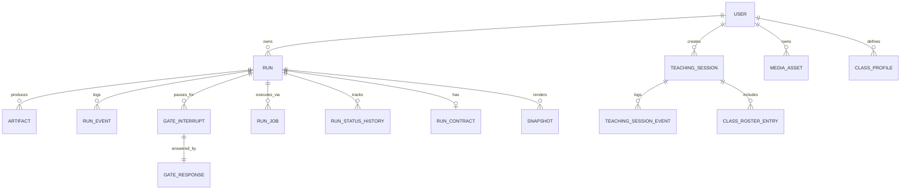

# Data Model: oh-my-class

## User

**Owned by:** [gateway](modules/gateway.md) (SQLAlchemy: `models.User`)

- `id` (UUID), `email`, `role` (TEACHER/ADMIN/SCHOOL_ADMIN/SYSTEM_ADMIN)
- `organization_id` (pending migration for school_admin cross-tenant)

## Run

**Owned by:** [gateway](modules/gateway.md) (SQLAlchemy: `models.Run`, `teaching_pack_models.py`)

- `id` (UUID), `teacher_id`, `class_id`, `mode` (generate_pack/plan_unit), `status`
- `unit_parent_id`, `unit_session_number` (for unit hierarchy)
- `created_at`, `updated_at`, `deleted_at` (soft delete)

## RunContract

**Owned by:** [contracts](modules/contracts.md) (Pydantic: `RunContract`)
**Persisted by:** [gateway](modules/gateway.md) (SQLAlchemy: `teaching_pack_models.RunContract`)

- `mode`, `topic`, `grade_level`, `subject`, `locale`
- `artifact_types`, `export_formats`, `methodology_tags`
- `research_policy` (basic/standard/rigorous)

## Artifact

**Owned by:** [gateway](modules/gateway.md)

- `id`, `run_id`, `type` (lesson/worksheet/quiz/drill/recap/infographic/flashcard_deck/answer_key/roadmap/slide_deck)
- `content` (JSON), `version`, `parent_artifact_id` (for edits)

## RunEvent

**Owned by:** [gateway](modules/gateway.md)

- `id`, `run_id`, `event_type`, `payload` (JSON)
- `sequence_number` (per-run ordering), `visibility` (teacher/admin/internal)
- Append-only, used as SSE source of truth

## GateInterrupt / GateResponse

**Owned by:** [gateway](modules/gateway.md)

- `GateInterrupt`: `run_id`, `gate_type`, `status` (active/responded/expired/cancelled), `opened_at`, `expires_at`
- `GateResponse`: `interrupt_id`, `action` (approve/edit/reject), `feedback`, `edits`

## RunJob

**Owned by:** [gateway](modules/gateway.md)

- `id`, `run_id`, `job_type` (start/resume), `status` (pending/claimed/running/completed/failed)
- `lease_until`, `worker_id`, `idempotency_key`, `attempts`

## TeachingSession

**Owned by:** [gateway](modules/gateway.md) (SQLAlchemy: `teaching_session.models.TeachingSession`)

- `id`, `class_id`, `teacher_id`, `status` (scheduled/live/ended/archived/expired)
- `retention_tier` (none/aggregate/pseudonymous/identifiable)
- `room_code`, `snapshot_id`

## TeachingSessionEvent

**Owned by:** [gateway](modules/gateway.md)

- `id`, `session_id`, `event_type`, `payload` — SSE source of truth (Postgres = write-behind, Redis = hot path)

## ClassRosterEntry

**Owned by:** [gateway](modules/gateway.md)

- `session_id`, `student_pseudonym` (FNV-1a hashed), `display_name` (optional)

## MediaAsset

**Owned by:** [gateway](modules/gateway.md)

- `id`, `teacher_id`, `filename`, `content_type`, `size_bytes`, `data` (base64 or path)
- `tags`, `alt_text`, `alt_text_status` (pending/accepted)

## ClassProfile

**Owned by:** [gateway](modules/gateway.md) (Pydantic: `ClassProfile`)

- `teacher_id`, `class_id`, `grade`, `subject`, `student_count`
- `learning_preferences` (Pydantic: `LearningPreferences`)

## CostLog

**Owned by:** [gateway](modules/gateway.md)

- `run_id`, `agent`, `model`, `input_tokens`, `output_tokens`, `cost_usd`
- Timestamp (litellm schema)
