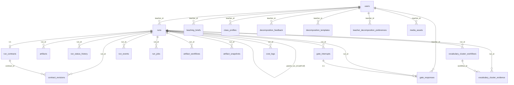

# Data Model

**Generated:** 2026-07-11
**Source of truth:** `services/gateway/models.py`, `services/gateway/teaching_pack_models.py`, `services/gateway/teaching_pack_artifact_models.py`, `services/gateway/teaching_pack_snapshot_models.py`, `services/gateway/vocabulary_cluster_models.py`
**ORM:** SQLAlchemy (DeclarativeBase, mapped_column)
**Databases:** PostgreSQL 16 (production/staging), SQLite (development checkpointer)

All application tables live under the `public` schema. LLM cost tracking lives under the `litellm` schema.

---

## Schema: public

### users
**Owner:** gateway | **File:** `services/gateway/models.py:62`
Teacher or admin accounts.

| Column | Type | Constraints | Notes |
|--------|------|-------------|-------|
| user_id | String(64) | PK | |
| username | String(128) | UNIQUE, NOT NULL | |
| email | String(256) | nullable | |
| role | Enum(UserRole) | NOT NULL | `teacher` or `admin` |
| created_at | DateTime(tz) | | Default: utc_now |
| last_login | DateTime | nullable | |

---

### runs
**Owner:** gateway | **File:** `services/gateway/models.py:75`
A teaching pack generation run. Central entity that most other tables reference.

| Column | Type | Constraints | Notes |
|--------|------|-------------|-------|
| run_id | String(64) | PK | |
| teacher_id | String(64) | NOT NULL | References users.user_id (logical, no FK constraint) |
| status | Enum(RunStatus) | NOT NULL | pending/planning/researching/generating/reviewing/awaiting_approval/exporting/completed/failed/cancelled |
| current_step | Integer | | Default: 1 |
| raw_request | Text | NOT NULL | Original teacher request |
| class_info | JSON | nullable | `{grade, subject, student_count, language}` |
| lesson_plan | JSON | nullable | LessonPlan JSON |
| artifact_types | JSON | nullable | List of artifact type strings |
| theme | String(32) | | Default: `default` |
| quality_scores | JSON | nullable | Quality gate scores |
| quality_passed | Boolean | | Default: false |
| teacher_approved | Boolean | | Default: false |
| revision_count | Integer | | Default: 0 |
| revision_feedback | Text | nullable | |
| export_formats | JSON | nullable | `["html", "gift", "h5p"]` |
| tokens_used | Integer | | Default: 0 |
| cost_usd | Float | | Default: 0.0 |
| created_at | DateTime(tz) | | |
| updated_at | DateTime(tz) | | auto-updates |
| deleted_at | DateTime(tz) | nullable | Soft delete |
| deleted_by | String(64) | nullable | |
| retention_days | Integer | nullable | |
| parent_run_id | String(64) | FK → runs.run_id, CASCADE | Self-referential for unit sessions |
| session_id | String(64) | nullable | Groups unit sessions |
| session_index | Integer | nullable | Ordering within session |
| unit_role | Enum(UnitRole) | NOT NULL | `standalone` / `unit_parent` / `unit_session` |
| lesson_sequence | JSON | nullable | Unit lesson ordering |
| shared_research | JSON | nullable | Shared research across unit |
| persona_snapshot | JSON | nullable | |

**Constraints:**
- `uq_runs_parent_session`: UNIQUE (parent_run_id, session_id)
- `ix_runs_parent_run_id`: INDEX on parent_run_id

---

### artifacts
**Owner:** gateway | **File:** `services/gateway/models.py:212`
A generated artifact (lesson, worksheet, quiz, etc.) within a run.

| Column | Type | Constraints | Notes |
|--------|------|-------------|-------|
| artifact_id | String(64) | PK | |
| run_id | String(64) | NOT NULL | References runs.run_id (logical, no FK) |
| artifact_type | String(32) | NOT NULL | lesson/worksheet/quiz/drill/recap/infographic/etc. |
| title | String(200) | NOT NULL | |
| theme | String(32) | | Default: `default` |
| content_json | JSON | nullable | ArtifactContent JSON |
| rendered_html | Text | nullable | Final rendered HTML |
| quality_score | Float | nullable | |

---

### teaching_briefs
**Owner:** gateway | **File:** `services/gateway/models.py:125`
Teacher-authored lesson briefs (input to planning).

| Column | Type | Constraints | Notes |
|--------|------|-------------|-------|
| brief_id | String(64) | PK | |
| teacher_id | String(64) | NOT NULL | |
| brief_json | JSON | NOT NULL | |
| created_at | DateTime(tz) | | |
| updated_at | DateTime(tz) | | |

---

### class_profiles
**Owner:** gateway | **File:** `services/gateway/models.py:141`
Teacher-defined class profiles (student demographics, grade, subject).

| Column | Type | Constraints | Notes |
|--------|------|-------------|-------|
| class_profile_id | String(64) | PK | |
| teacher_id | String(64) | NOT NULL | |
| profile_json | JSON | NOT NULL | |
| schema_version | String(64) | NOT NULL | |
| created_at | DateTime(tz) | | |
| updated_at | DateTime(tz) | | |
| deleted_at | DateTime(tz) | nullable | Soft delete |
| retention_days | Integer | nullable | |

---

### decomposition_feedback
**Owner:** gateway | **File:** `services/gateway/models.py:160`
Teacher feedback on unit decomposition proposals.

| Column | Type | Constraints | Notes |
|--------|------|-------------|-------|
| feedback_id | String(64) | PK | |
| teacher_id | String(64) | NOT NULL | |
| session_id | String(64) | nullable | |
| proposed_sequence | JSON | NOT NULL | |
| approved_sequence | JSON | NOT NULL | |
| edit_types | JSON | NOT NULL | List of edit type strings |
| created_at | DateTime(tz) | | |

---

### decomposition_templates
**Owner:** gateway | **File:** `services/gateway/models.py:176`
Reusable unit decomposition templates, keyed by topic/grade/subject/locale.

| Column | Type | Constraints | Notes |
|--------|------|-------------|-------|
| template_id | String(64) | PK | |
| teacher_id | String(64) | NOT NULL | |
| topic_normalized | String(200) | NOT NULL | |
| grade | String(64) | NOT NULL | |
| subject | String(80) | NOT NULL | |
| locale | String(16) | NOT NULL | |
| approved_sequence | JSON | NOT NULL | |
| updated_at | DateTime(tz) | | |

**Constraints:**
- `uq_decomposition_template_key`: UNIQUE (teacher_id, topic_normalized, grade, subject, locale)

---

### teacher_decomposition_preferences
**Owner:** gateway | **File:** `services/gateway/models.py:200`
Per-teacher preferences for unit decomposition behavior.

| Column | Type | Constraints | Notes |
|--------|------|-------------|-------|
| teacher_id | String(64) | PK, UNIQUE | |
| preferences | JSON | NOT NULL | |
| updated_at | DateTime(tz) | | |

---

### media_assets
**Owner:** gateway | **File:** `services/gateway/models.py:228`
Teacher-owned images/diagrams, reusable across decks. Storage keys are teacher-scoped (`teacher-media/{teacher_id}/{asset_id}.{ext}`).

| Column | Type | Constraints | Notes |
|--------|------|-------------|-------|
| asset_id | String(64) | PK | |
| teacher_id | String(64) | NOT NULL | |
| filename | String(255) | NOT NULL | |
| content_type | String(100) | NOT NULL | MIME type |
| storage_key | String(255) | NOT NULL | Object storage path |
| tags | JSON | NOT NULL | Default: [] |
| alt_text | Text | nullable | AI-generated or teacher-provided |
| created_at | DateTime(tz) | | |

---

### run_status_history
**Owner:** gateway | **File:** `services/gateway/teaching_pack_models.py:96`
Audit trail of status transitions for each run.

| Column | Type | Constraints | Notes |
|--------|------|-------------|-------|
| id | BigInteger | PK, autoincrement | |
| run_id | String(64) | FK → runs.run_id, CASCADE, NOT NULL | |
| status | Enum(RunStatus) | NOT NULL | |
| stage | String(64) | nullable | Pipeline stage name |
| reason | Text | nullable | |
| created_at | DateTime(tz) | | |

---

### run_contracts
**Owner:** gateway | **File:** `services/gateway/teaching_pack_models.py:113`
The active RunContract for a teaching pack run (scope, artifacts, constraints).

| Column | Type | Constraints | Notes |
|--------|------|-------------|-------|
| contract_id | String(64) | PK | |
| run_id | String(64) | FK → runs.run_id, CASCADE, UNIQUE, NOT NULL | One contract per run |
| teacher_id | String(64) | NOT NULL | |
| contract_json | JSON | NOT NULL | RunContract payload |
| current_revision | Integer | NOT NULL | Default: 1 |
| created_at | DateTime(tz) | | |
| updated_at | DateTime(tz) | | |

---

### contract_revisions
**Owner:** gateway | **File:** `services/gateway/teaching_pack_models.py:133`
Immutable revision history for RunContract changes.

| Column | Type | Constraints | Notes |
|--------|------|-------------|-------|
| id | BigInteger | PK, autoincrement | |
| contract_id | String(64) | FK → run_contracts.contract_id, CASCADE, NOT NULL | |
| run_id | String(64) | FK → runs.run_id, CASCADE, NOT NULL | |
| revision | Integer | NOT NULL | Monotonic counter |
| contract_json | JSON | NOT NULL | Snapshot at this revision |
| created_at | DateTime(tz) | | |

**Constraints:**
- `uq_contract_revisions_revision`: UNIQUE (contract_id, revision)

---

### gate_interrupts
**Owner:** gateway | **File:** `services/gateway/teaching_pack_models.py:155`
HITL gate interrupts (teacher approval gates). Only one active interrupt per (run_id, gate_name).

| Column | Type | Constraints | Notes |
|--------|------|-------------|-------|
| gate_id | String(64) | PK | |
| run_id | String(64) | FK → runs.run_id, CASCADE, NOT NULL | |
| gate_name | String(64) | NOT NULL | e.g. `content_approval`, `unit_approval` |
| status | Enum(GateInterruptStatus) | NOT NULL | active/responded/expired/cancelled |
| payload | JSON | NOT NULL | Data shown to teacher |
| created_at | DateTime(tz) | | |
| expires_at | DateTime(tz) | nullable | 24h TTL |

**Constraints:**
- Partial unique index `uq_gate_interrupts_active` on (run_id, gate_name) WHERE status = 'active'

---

### gate_responses
**Owner:** gateway | **File:** `services/gateway/teaching_pack_models.py:182`
Teacher responses to gate interrupts.

| Column | Type | Constraints | Notes |
|--------|------|-------------|-------|
| response_id | String(64) | PK | |
| gate_id | String(64) | FK → gate_interrupts.gate_id, CASCADE, UNIQUE, NOT NULL | One response per gate |
| run_id | String(64) | FK → runs.run_id, CASCADE, NOT NULL | |
| teacher_id | String(64) | NOT NULL | |
| response_json | JSON | NOT NULL | approve/edit/reject payload |
| created_at | DateTime(tz) | | |

---

### run_events
**Owner:** gateway | **File:** `services/gateway/teaching_pack_models.py:204`
Ordered event log for a run. Used for SSE streaming and audit.

| Column | Type | Constraints | Notes |
|--------|------|-------------|-------|
| id | BigInteger | PK, autoincrement | |
| run_id | String(64) | FK → runs.run_id, CASCADE, NOT NULL | |
| sequence | BigInteger | NOT NULL | Monotonic per run |
| event_name | String(128) | NOT NULL | |
| stage | String(64) | nullable | Pipeline stage |
| visibility | Enum(TeachingPackEventVisibility) | NOT NULL | teacher/admin/internal |
| payload | JSON | nullable | |
| created_at | DateTime(tz) | | |

**Constraints:**
- `uq_run_events_run_sequence`: UNIQUE (run_id, sequence)

---

### run_jobs
**Owner:** gateway | **File:** `services/gateway/teaching_pack_models.py:227`
Job queue for start/resume operations with idempotency and lease-based locking.

| Column | Type | Constraints | Notes |
|--------|------|-------------|-------|
| job_id | String(64) | PK | |
| run_id | String(64) | FK → runs.run_id, CASCADE, NOT NULL | |
| kind | Enum(RunJobKind) | NOT NULL | `start` / `resume` |
| status | Enum(RunJobStatus) | NOT NULL | pending/queued/running/completed/failed/cancelled |
| idempotency_key | String(128) | NOT NULL, UNIQUE | |
| payload | JSON | NOT NULL | |
| attempts | Integer | NOT NULL | Default: 0 |
| eligible_at | DateTime(tz) | nullable | For delayed retry |
| lease_owner | String(128) | nullable | Worker ID holding the lease |
| lease_expires_at | DateTime(tz) | nullable | Lease TTL |
| created_at | DateTime(tz) | | |
| updated_at | DateTime(tz) | | |

---

### artifact_workflows
**Owner:** gateway | **File:** `services/gateway/teaching_pack_artifact_models.py:40`
Per-artifact generation workflow tracking (attempts, validation, judge status).

| Column | Type | Constraints | Notes |
|--------|------|-------------|-------|
| workflow_id | String(64) | PK | |
| run_id | String(64) | FK → runs.run_id, CASCADE, NOT NULL | |
| artifact_id | String(64) | NOT NULL | |
| artifact_type | String(32) | NOT NULL | |
| status | Enum(ArtifactWorkflowStatus) | NOT NULL | queued/running/validating/healing/passed/failed/skipped/escalated |
| attempts | Integer | NOT NULL | Default: 0 |
| contract_revision_id | Integer | NOT NULL | Default: 1 |
| research_guidance_id | String(64) | NOT NULL | |
| validation_status | Enum(ArtifactCheckStatus) | NOT NULL | pending/passed/failed/skipped |
| judge_status | Enum(ArtifactCheckStatus) | NOT NULL | pending/passed/failed/skipped |
| snapshot_refs | JSON | NOT NULL | Default: [] |
| snapshot_id | String(64) | nullable | |
| last_error | Text | nullable | |
| updated_at | DateTime(tz) | | |

**Constraints:**
- `uq_artifact_workflows_artifact`: UNIQUE (run_id, artifact_id)

---

### artifact_snapshots
**Owner:** gateway | **File:** `services/gateway/teaching_pack_snapshot_models.py:16`
Content-addressed snapshots of rendered artifacts. One per unique content hash.

| Column | Type | Constraints | Notes |
|--------|------|-------------|-------|
| snapshot_id | String(64) | PK | |
| run_id | String(64) | FK → runs.run_id, CASCADE, NOT NULL | |
| artifact_id | String(64) | NOT NULL | |
| artifact_type | String(32) | NOT NULL | |
| content_hash | String(64) | NOT NULL, UNIQUE | SHA of content_json |
| html_hash | String(64) | NOT NULL | SHA of rendered HTML |
| content_json | JSON | nullable | ArtifactContent |
| rendered_html | Text | NOT NULL | Full HTML |
| student_rendered_html | Text | NOT NULL | Student-facing HTML (no answers) |
| renderer_version | String(64) | NOT NULL | |
| template_version | String(64) | NOT NULL | Default: `unknown` |
| theme_version | String(64) | NOT NULL | Default: `unknown` |
| standalone_valid | Boolean | NOT NULL | Default: false |
| approved_at | DateTime(tz) | nullable | |
| created_at | DateTime(tz) | | |

---

### vocabulary_cluster_workflows
**Owner:** gateway | **File:** `services/gateway/vocabulary_cluster_models.py:47`
Per-cluster vocabulary workflow tracking.

| Column | Type | Constraints | Notes |
|--------|------|-------------|-------|
| workflow_id | String(120) | PK | |
| cluster_id | String(120) | NOT NULL | |
| run_id | String(64) | FK → runs.run_id, CASCADE, NOT NULL | |
| normalized_input | JSON | NOT NULL | List of normalized terms |
| raw_input_span | Text | NOT NULL | Original text span |
| status | Enum(VocabularyClusterWorkflowStatus) | NOT NULL | queued/grounding/synthesizing/practice_generating/validating/needs_review/passed/failed/skipped/exported |
| attempts | Integer | NOT NULL | Default: 0 |
| review_status | Enum(VocabularyClusterReviewStatus) | NOT NULL | pending/needs_review/approved/rejected |
| export_refs | JSON | NOT NULL | Default: {} |
| snapshot_hash | String(64) | nullable | |
| last_error | Text | nullable | |
| updated_at | DateTime(tz) | | |

**Constraints:**
- `uq_vocabulary_cluster_workflows_cluster`: UNIQUE (run_id, cluster_id)

---

### vocabulary_cluster_evidence
**Owner:** gateway | **File:** `services/gateway/vocabulary_cluster_models.py:75`
Audit trail for vocabulary cluster processing steps.

| Column | Type | Constraints | Notes |
|--------|------|-------------|-------|
| evidence_id | String(120) | PK | |
| workflow_id | String(120) | FK → vocabulary_cluster_workflows.workflow_id, CASCADE, NOT NULL | |
| cluster_id | String(120) | NOT NULL | |
| run_id | String(64) | FK → runs.run_id, CASCADE, NOT NULL | |
| sequence | BigInteger | NOT NULL | Monotonic per workflow |
| event_type | Enum(VocabularyClusterEvidenceType) | NOT NULL | normalized_input/grounding_sources/generated_contract_version/quality_result/teacher_edit/approval/export_ref/retry |
| payload | JSON | NOT NULL | |
| created_at | DateTime(tz) | | |

**Constraints:**
- `uq_vocabulary_cluster_evidence_sequence`: UNIQUE (workflow_id, sequence)

---

## Schema: litellm

### cost_logs
**Owner:** gateway | **File:** `services/gateway/models.py:254`
LLM cost tracking per API call.

| Column | Type | Constraints | Notes |
|--------|------|-------------|-------|
| id | Integer | PK, autoincrement | |
| run_id | String(64) | NOT NULL | References runs.run_id (logical) |
| agent | String(64) | NOT NULL | Agent name |
| model | String(128) | NOT NULL | Model identifier |
| prompt_tokens | Integer | | Default: 0 |
| completion_tokens | Integer | | Default: 0 |
| cost_usd | Float | | Default: 0.0 |
| created_at | DateTime(tz) | | |

---

## Relationships

### Relationship Summary

| From | To | FK | Cardinality | On Delete |
|------|----|----|-------------|-----------|
| runs | runs | parent_run_id → run_id | 0..* parent to 0..* children | CASCADE |
| run_contracts | runs | run_id → run_id | 1:1 | CASCADE |
| contract_revisions | run_contracts | contract_id → contract_id | 0..* | CASCADE |
| contract_revisions | runs | run_id → run_id | 0..* | CASCADE |
| gate_interrupts | runs | run_id → run_id | 0..* | CASCADE |
| gate_responses | gate_interrupts | gate_id → gate_id | 0..1:1 | CASCADE |
| gate_responses | runs | run_id → run_id | 0..* | CASCADE |
| run_status_history | runs | run_id → run_id | 0..* | CASCADE |
| run_events | runs | run_id → run_id | 0..* | CASCADE |
| run_jobs | runs | run_id → run_id | 0..* | CASCADE |
| artifact_workflows | runs | run_id → run_id | 0..* | CASCADE |
| artifact_snapshots | runs | run_id → run_id | 0..* | CASCADE |
| vocabulary_cluster_workflows | runs | run_id → run_id | 0..* | CASCADE |
| vocabulary_cluster_evidence | vocabulary_cluster_workflows | workflow_id → workflow_id | 0..* | CASCADE |
| vocabulary_cluster_evidence | runs | run_id → run_id | 0..* | CASCADE |

---

## Design Notes

- **No hard FK from runs.teacher_id to users.user_id.** The relationship is logical, enforced at the application layer. This avoids circular dependency issues during development and allows the auth system to operate independently.
- **Soft deletes** on `runs` and `class_profiles` via `deleted_at`/`deleted_by` columns. Rows are never physically removed.
- **Content-addressed snapshots** via `artifact_snapshots.content_hash`. Duplicate content produces the same hash, avoiding redundant storage.
- **Idempotent job queue** in `run_jobs` with lease-based locking (`lease_owner` + `lease_expires_at`). The `idempotency_key` prevents duplicate job creation.
- **Partial unique index** on `gate_interrupts` ensures only one active interrupt per (run, gate_name) while allowing historical responded/expired records.
- **Unit decomposition** uses `runs.parent_run_id` (self-referential FK) plus `session_id` to group related runs. The `unit_role` enum distinguishes standalone runs from unit parents and sessions.
