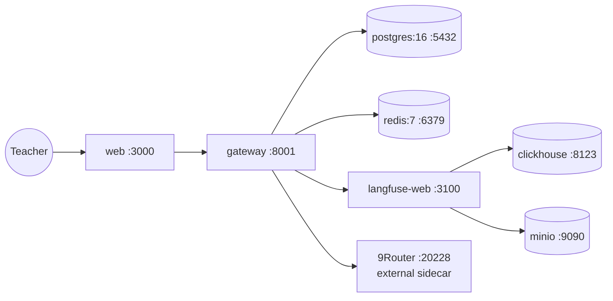

# Deployment: oh-my-class

## Services

| Service | Module(s) | Ports | Depends on | File |
|---------|-----------|-------|-----------|------|
| `db` | — | 5432 | — | [infra/compose/docker-compose.yml:3-18](infra/compose/docker-compose.yml) |
| `redis` | — | 6379 | — | [infra/compose/docker-compose.yml:21-31](infra/compose/docker-compose.yml) |
| `gateway` | `services/gateway` | 8001 | db, redis, langfuse-web | [infra/compose/docker-compose.yml:35-53](infra/compose/docker-compose.yml) |
| `web` | `apps/web` | 3000 | gateway | [infra/compose/docker-compose.yml:164-172](infra/compose/docker-compose.yml) |
| `langfuse-web` | external | 3100 | db, clickhouse, redis, minio | [infra/compose/docker-compose.yml:56-107](infra/compose/docker-compose.yml) |
| `langfuse-worker` | external | — | db, clickhouse, redis, minio | [infra/compose/docker-compose.yml:110-117](infra/compose/docker-compose.yml) |
| `clickhouse` | external | 8123, 9000 | — | [infra/compose/docker-compose.yml:120-139](infra/compose/docker-compose.yml) |
| `minio` | external | 9090, 9091 | — | [infra/compose/docker-compose.yml:142-158](infra/compose/docker-compose.yml) |

## Port Configuration

The gateway runs on **different ports in local dev vs Docker — this is intentional**:

| Environment | Gateway port | Source |
|-------------|-------------|--------|
| Local dev (`make dev`) | `:8101` | `Makefile:39` `LOCAL_GATEWAY_PORT := 8101` |
| Docker (`compose up`) | `:8001` | `infra/compose/docker-compose.yml:40` `8001:8001` |

The web client targets the gateway via `NEXT_PUBLIC_GATEWAY_URL` — defaults to `http://localhost:8101` in local dev (`apps/web/src/lib/api-client.ts:7`), overridden to `:8001` for the Docker web service.

## Volumes

- `pgdata` — PostgreSQL data
- `langfuse_clickhouse_data` / `langfuse_clickhouse_logs` — ClickHouse persistence
- `langfuse_minio_data` — MinIO object storage

## Local Development

- `make setup` — Bootstrap dev environment
- `make dev` — Start db/redis in Docker + gateway + web locally
- `make docker` — Start full Docker dev stack
- `make test` — Run all tests (Python + TypeScript)
- `make check` — Tests + build + linters + report format check
