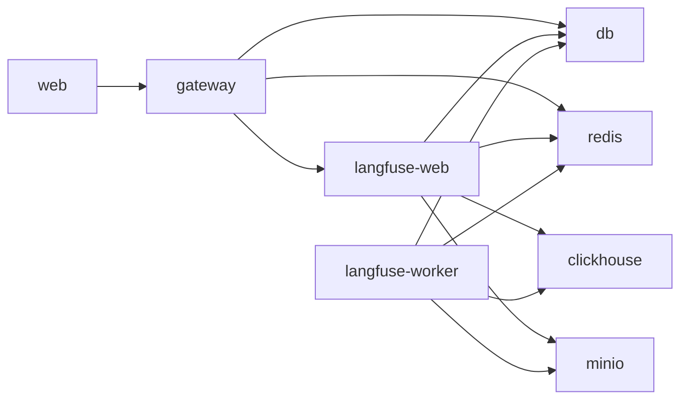

# Deployment

**Generated:** 2026-07-11
**Source of truth:** `infra/compose/docker-compose.yml`, `infra/compose/docker-compose.prod.yml`, `infra/compose/init-db.sh`

## Services

| Service | Port (Docker) | Port (Local) | Image/Build | Purpose |
|---------|---------------|--------------|-------------|---------|
| db | 5432 | 5432 | `postgres:16-alpine` | Primary application datastore |
| redis | 6379 | 6379 | `redis:7-alpine` | Circuit breaker, session cache, Langfuse queue |
| gateway | 8001 | 8101 | `infra/docker/Dockerfile.gateway` | FastAPI HTTP API + embedded agent runtime |
| web | 3000 | 3000 | `infra/docker/Dockerfile.web` | Next.js frontend dashboard |
| langfuse-web | 3100 | 3100 | `langfuse/langfuse:3` | Langfuse observability UI |
| langfuse-worker | (none) | (none) | `langfuse/langfuse-worker:3` | Langfuse background worker (opt-in via `langfuse-worker` profile) |
| clickhouse | 127.0.0.1:8123, 127.0.0.1:9000 | 127.0.0.1:8123, 127.0.0.1:9000 | `clickhouse/clickhouse-server` | Langfuse v3 traces/observations store |
| minio | 9090 (API), 127.0.0.1:9091 (console) | 9090, 127.0.0.1:9091 | `cgr.dev/chainguard/minio` | Langfuse v3 object storage (events + media) |

### Local dev ports (`make dev`)

The gateway binds to **8101** in local dev (set in `Makefile:39` as `LOCAL_GATEWAY_PORT := 8101`). The web client targets this via `NEXT_PUBLIC_GATEWAY_URL=http://localhost:8101` (`apps/web/src/lib/api-client.ts:7`).

### Docker ports

In Docker Compose, the gateway exposes **8001** (`docker-compose.yml:40`). The web service overrides `NEXT_PUBLIC_GATEWAY_URL` to `http://localhost:8001`.

---

## Infrastructure

### PostgreSQL (db)

| Property | Value |
|----------|-------|
| Image | `postgres:16-alpine` |
| Database | `oh_my_class` (app), `langfuse` (observability) |
| User | `omc_dev` |
| Volume | `pgdata` → `/var/lib/postgresql/data` |
| Health check | `pg_isready -U omc_dev` (3s interval, 10 retries) |
| Init script | `init-db.sh` creates the `langfuse` database and grants privileges |
| Production limits | 2 GB memory |

### Redis (redis)

| Property | Value |
|----------|-------|
| Image | `redis:7-alpine` |
| Auth | Password via `$REDIS_AUTH` (default: `omc_redis_secret`) |
| Eviction | `noeviction` (reject writes when memory full) |
| Health check | `redis-cli ping` (3s interval, 10 retries) |
| Production limits | 512 MB memory |

### ClickHouse (clickhouse)

| Property | Value |
|----------|-------|
| Image | `clickhouse/clickhouse-server` |
| Purpose | Langfuse v3 traces and observations |
| Ports | 8123 (HTTP), 9000 (native) bound to `127.0.0.1` only |
| Volumes | `langfuse_clickhouse_data`, `langfuse_clickhouse_logs` |
| Health check | `wget http://localhost:8123/ping` (5s interval, 10 retries) |

### MinIO (minio)

| Property | Value |
|----------|-------|
| Image | `cgr.dev/chainguard/minio` |
| Purpose | S3-compatible object storage for Langfuse events and media |
| API port | 9090 (mapped from container 9000) |
| Console port | 127.0.0.1:9091 (mapped from container 9001) |
| Credentials | `minio` / `$MINIO_ROOT_PASSWORD` (default: `minio_secret`) |
| Volume | `langfuse_minio_data` → `/data` |
| Bucket | `langfuse` (auto-created by Langfuse) |
| Health check | `mc ready local` (1s interval, 5 retries) |

---

## Volumes

| Volume | Used By | Purpose |
|--------|---------|---------|
| `pgdata` | db | PostgreSQL data directory |
| `langfuse_clickhouse_data` | clickhouse | ClickHouse data |
| `langfuse_clickhouse_logs` | clickhouse | ClickHouse logs |
| `langfuse_minio_data` | minio | MinIO object storage |

---

## Docker Compose Profiles

| Profile | Services | Activation |
|---------|----------|------------|
| `langfuse-worker` | langfuse-worker | `docker compose --profile langfuse-worker up` |

By default, `langfuse-worker` is excluded. The Langfuse web UI works without it, but background trace processing requires it in production.

---

## Production Overrides (`docker-compose.prod.yml`)

| Service | Change | Value |
|---------|--------|-------|
| db | Password | `$PROD_DB_PASSWORD` |
| db | Port mapping | Removed (not exposed to host) |
| db | Memory limit | 2 GB |
| redis | Memory limit | 512 MB |
| gateway | Restart policy | `always` |
| gateway | Replicas | 2 |
| gateway | Memory limit | 1 GB |
| web | Restart policy | `always` |
| web | Replicas | 2 |
| langfuse | Restart policy | `always` |
| langfuse | Secrets | `$LANGFUSE_NEXTAUTH_SECRET`, `$LANGFUSE_SALT` from env |
| langfuse | Memory limit | 1 GB |

Production removes the `db` port mapping so PostgreSQL is only accessible from within the Docker network. The gateway and web services run with 2 replicas each.

---

## Key Environment Variables

### Application

| Variable | Used By | Default | Purpose |
|----------|---------|---------|---------|
| `DATABASE_URL` | gateway | `postgresql://omc_dev:omc_dev@db:5432/oh_my_class` | SQLAlchemy connection string |
| `REDIS_URL` | gateway | `redis://:omc_redis_secret@redis:6379` | Redis connection string |
| `REDIS_AUTH` | redis, gateway | `omc_redis_secret` | Redis password |
| `LANGFUSE_BASE_URL` | gateway | `http://langfuse-web:3000` | Langfuse API endpoint |
| `NEXT_PUBLIC_GATEWAY_URL` | web | `http://localhost:8001` (Docker), `http://localhost:8101` (local) | Gateway URL for frontend |
| `LITELLM_PROXY_URL` | gateway | (optional) | LiteLLM proxy endpoint (prod-only) |
| `LLM_BASE_URL` | agents | `http://localhost:20228/v1` | 9Router sidecar endpoint |

### Langfuse

| Variable | Used By | Default | Purpose |
|----------|---------|---------|---------|
| `NEXTAUTH_SECRET` | langfuse-web | `omc_langfuse_nextauth_secret` | Auth signing secret |
| `SALT` | langfuse-web | `omc_langfuse_salt` | Encryption salt |
| `ENCRYPTION_KEY` | langfuse-web | `000...000` | Data encryption key (change in prod) |
| `CLICKHOUSE_PASSWORD` | clickhouse, langfuse-web | `clickhouse_secret` | ClickHouse password |
| `MINIO_ROOT_PASSWORD` | minio, langfuse-web | `minio_secret` | MinIO root password |

### Production-only secrets (must set in `.env`)

| Variable | Purpose |
|----------|---------|
| `PROD_DB_PASSWORD` | PostgreSQL password |
| `LANGFUSE_NEXTAUTH_SECRET` | Langfuse auth secret |
| `LANGFUSE_SALT` | Langfuse encryption salt |
| `CLICKHOUSE_PASSWORD` | ClickHouse password |
| `MINIO_ROOT_PASSWORD` | MinIO root password |

---

## Service Dependency Graph



All services use `depends_on` with health checks to ensure orderly startup. The gateway waits for `db` (healthy), `redis` (healthy), and `langfuse-web` (started). Langfuse services wait for `db`, `clickhouse`, `redis`, and `minio` to be healthy.

---

## Database Initialization

The `init-db.sh` script runs as a PostgreSQL entrypoint on first startup:

```sql
CREATE DATABASE langfuse;
GRANT ALL PRIVILEGES ON DATABASE langfuse TO omc_dev;
```

This creates the separate `langfuse` database alongside the application's `oh_my_class` database. Both live on the same PostgreSQL instance.

---

## Local Development

```bash
# Start all services
docker compose up -d

# Start with Langfuse worker (for production-like observability)
docker compose --profile langfuse-worker up -d

# Local dev without Docker (gateway + web only)
make dev  # Gateway on :8101, web on :3000
```

The gateway in local dev (`make dev`) connects to PostgreSQL at `localhost:5432` and Redis at `localhost:6379` directly, bypassing Docker networking. The `DATABASE_URL` and `REDIS_URL` are configured in the `.env` file for this path.
