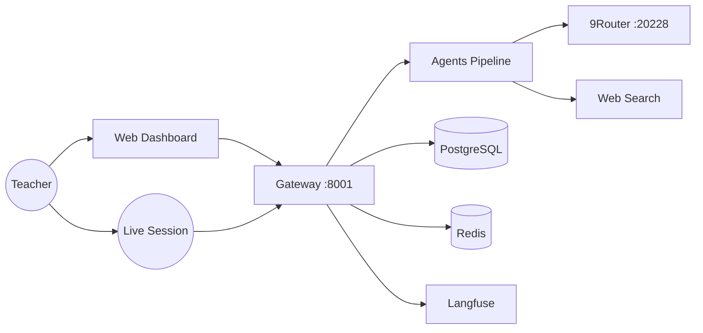
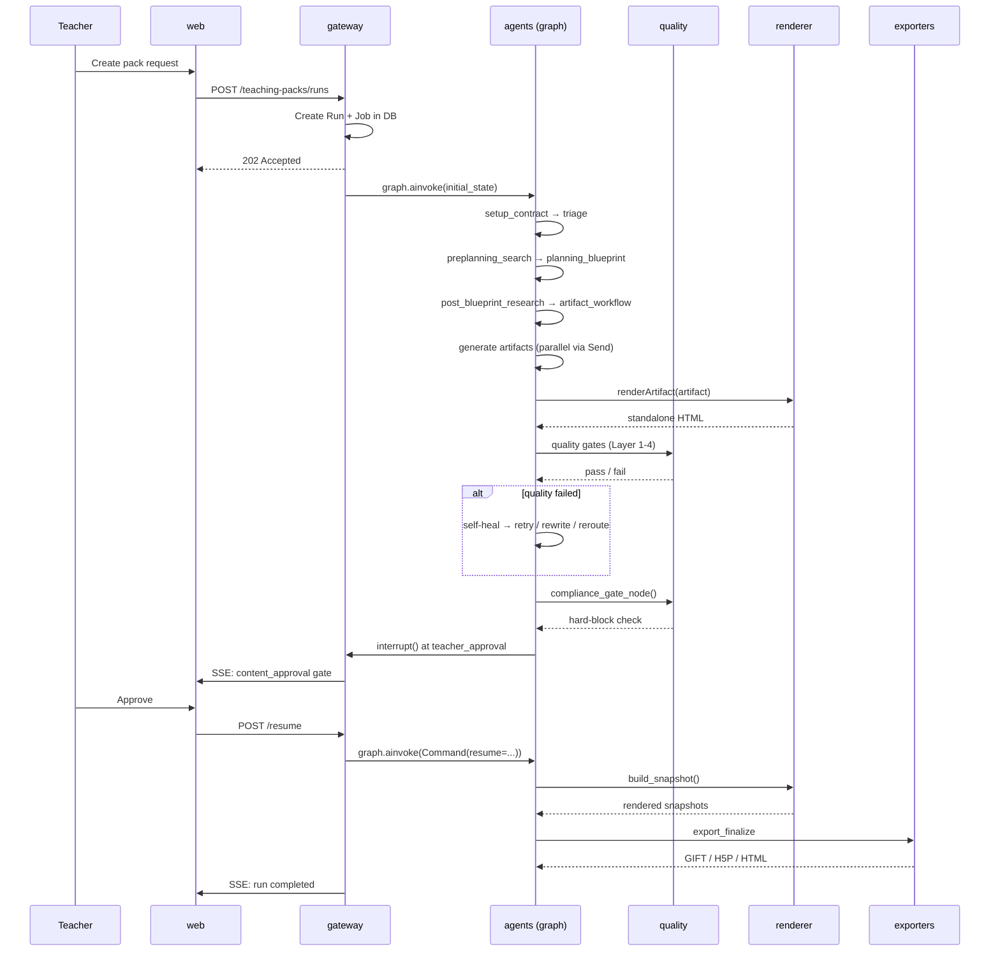
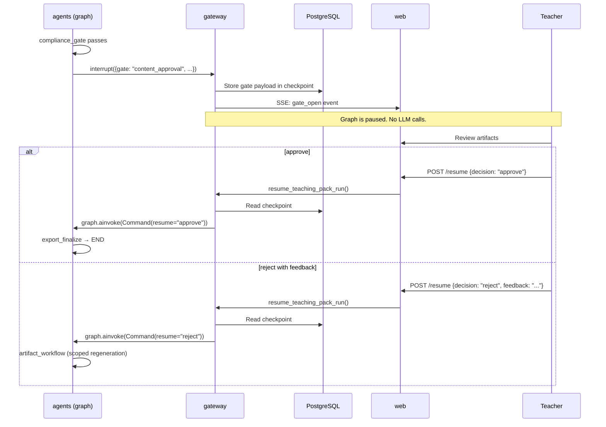

# System Diagram: oh-my-class

**Generated:** 2026-07-11

## System Context



## Module Dependency Graph

```mermaid
graph TD
    agents[agents<br/>LangGraph pipeline]
    gateway[gateway<br/>FastAPI HTTP]
    quality[quality<br/>6-Layer Gates]
    renderer[renderer<br/>Eta Templates]
    exporters[exporters<br/>GIFT/H5P/Anki]
    web[web<br/>Next.js Dashboard]
    contracts[contracts<br/>Pydantic v2]
    schemas[schemas<br/>Zod Types]
    "llm-client"[llm-client<br/>LLM Wrapper]
    notifications[notifications<br/>Fan-out]
    methodologies[methodologies<br/>Pedagogy]
    infra[infra<br/>Docker Compose]

    %% agents edges
    agents --> contracts
    agents --> quality
    agents --> "llm-client"
    agents --> methodologies

    %% gateway edges
    gateway --> agents
    gateway --> contracts
    gateway --> quality
    gateway --> renderer

    %% quality edges (note cycles with agents)
    quality --> contracts
    quality --> agents
    quality --> methodologies
    quality --> "llm-client"

    %% exporters edges
    exporters --> renderer
    exporters --> schemas

    %% renderer edge
    renderer --> schemas

    %% web edge
    web --> schemas

    %% methodologies edge
    methodologies --> contracts

    %% llm-client edge (cycle with agents)
    "llm-client" --> agents

    %% leaf modules (no outbound edges)
    notifications
    infra

    %% cycle styling
    linkStyle 1 stroke:#A1462F,stroke-width:2px
    linkStyle 7 stroke:#A1462F,stroke-width:2px
    linkStyle 8 stroke:#A1462F,stroke-width:2px
    linkStyle 12 stroke:#A1462F,stroke-width:2px
```

**Cycles (highlighted in red):** agents ↔ llm-client, agents ↔ quality

Modules: [agents](modules/agents.md) · [quality](modules/quality.md) · [renderer](modules/renderer.md) · [exporters](modules/exporters.md) · [gateway](modules/gateway.md) · [web](modules/web.md) · [contracts](modules/contracts.md) · [schemas](modules/schemas.md) · [llm-client](modules/llm-client.md) · [notifications](modules/notifications.md) · [methodologies](modules/methodologies.md) · [infra](modules/infra.md)

## Key Flows

### Flow 1: Teaching Pack Generation

The primary pipeline. A teacher's request flows through planning, content generation, quality checks, HITL approval, and export.



Modules involved: [gateway](modules/gateway.md), [agents](modules/agents.md), [quality](modules/quality.md), [renderer](modules/renderer.md), [exporters](modules/exporters.md)

### Flow 2: HITL Gate (Human-in-the-Loop)

LangGraph's `interrupt()` pauses the graph mid-execution. The gateway holds the checkpoint until the teacher acts.



Modules involved: [agents](modules/agents.md), [gateway](modules/gateway.md)

### Flow 3: Export

Artifact content JSON flows through the renderer (HTML) and exporters (GIFT, H5P) to produce downloadable files.

```mermaid
sequenceDiagram
    participant G as gateway
    participant R as renderer
    participant E as exporters
    participant T as Teacher

    G->>R: renderArtifact(artifact_json, theme)
    R->>R: Eta template + inline CSS
    R-->>G: standalone HTML string
    G->>G: Store rendered snapshot
    G->>E: exportGift(artifact_json)
    E-->>G: GIFT .txt string
    G->>E: exportH5P(artifact_json)
    E-->>G: .h5p ZIP buffer
    G->>G: Store export records in DB
    G-->>T: GET /exports returns download links
```



Modules involved: [gateway](modules/gateway.md), [renderer](modules/renderer.md), [exporters](modules/exporters.md)
