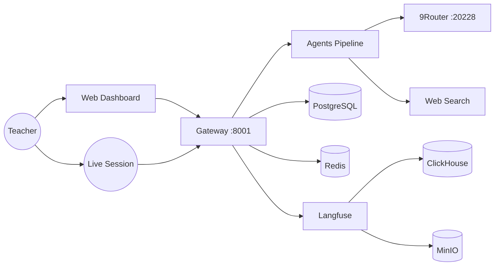
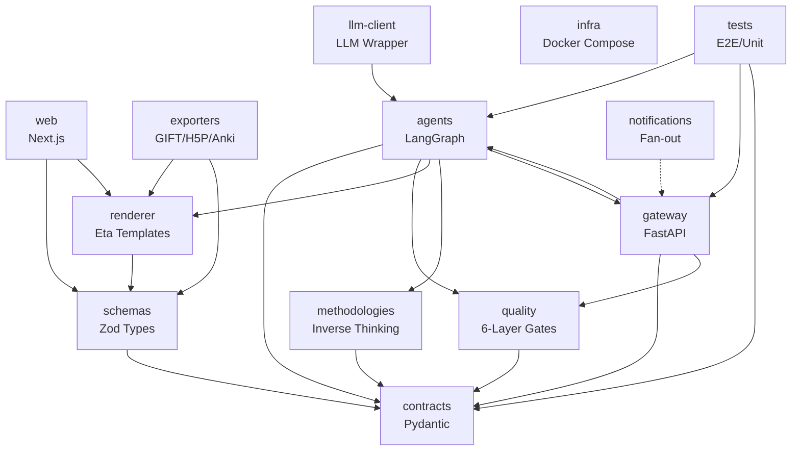
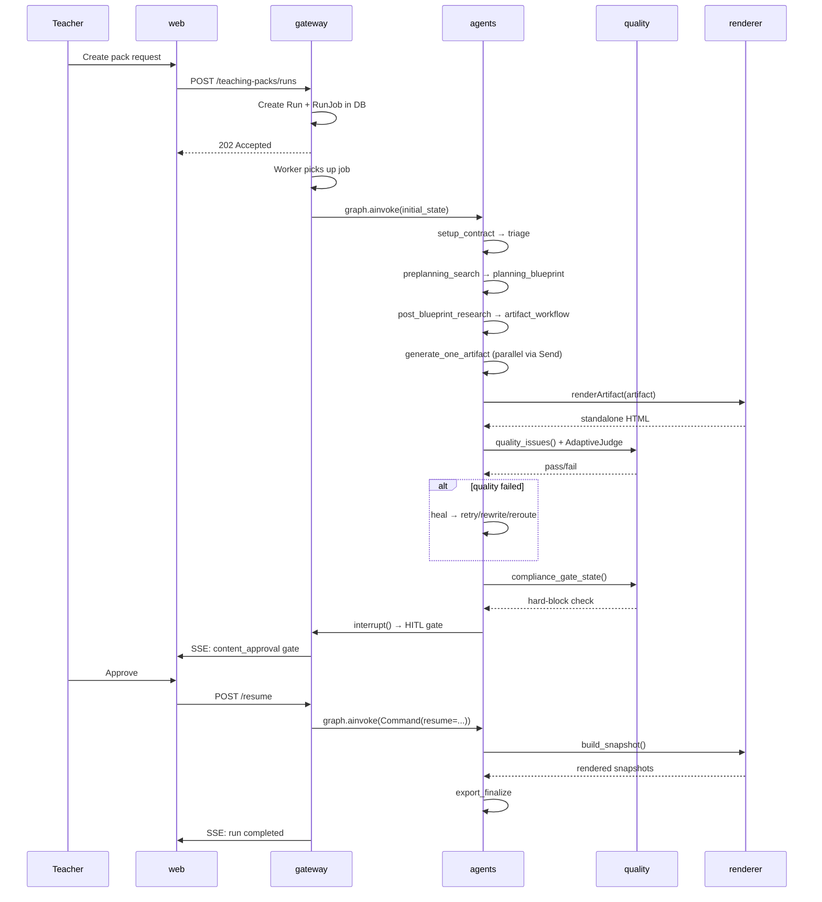
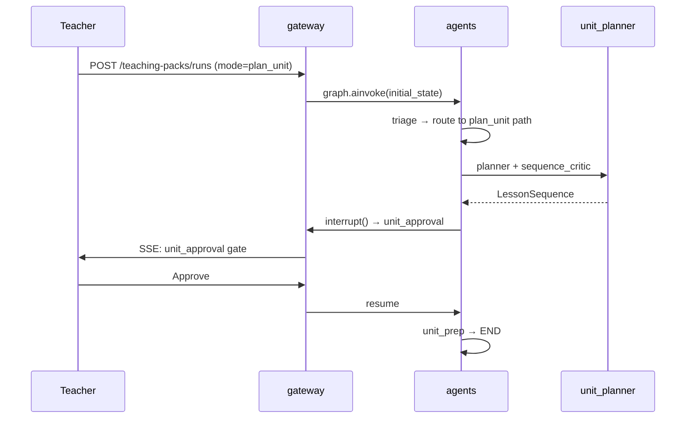
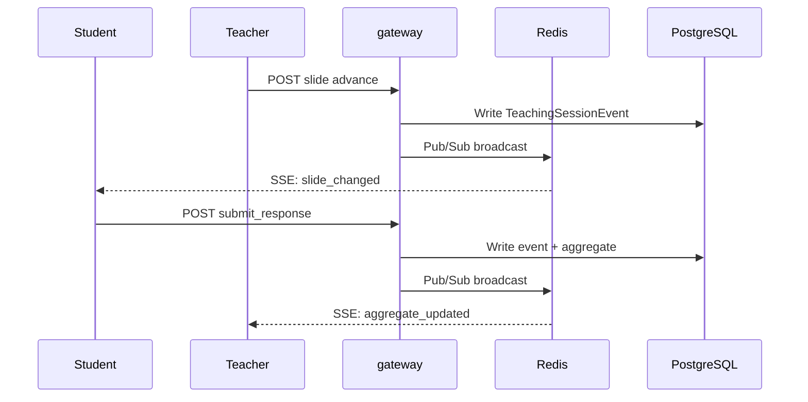

# System Diagram: oh-my-class

## System context

## Module dependency graph

Modules: [agents](modules/agents.md) · [quality](modules/quality.md) · [renderer](modules/renderer.md) · [exporters](modules/exporters.md) · [gateway](modules/gateway.md) · [web](modules/web.md) · [contracts](modules/contracts.md) · [schemas](modules/schemas.md) · [llm-client](modules/llm-client.md) · [notifications](modules/notifications.md) · [methodologies](modules/methodologies.md) · [infra](modules/infra.md)

## Key flows

### Teaching Pack Generation

Modules involved: [gateway](modules/gateway.md), [agents](modules/agents.md), [quality](modules/quality.md), [renderer](modules/renderer.md)

### Unit Planning (Multi-Session)

Modules involved: [agents](modules/agents.md), [gateway](modules/gateway.md)

### Live Teaching Session

Modules involved: [gateway](modules/gateway.md)
