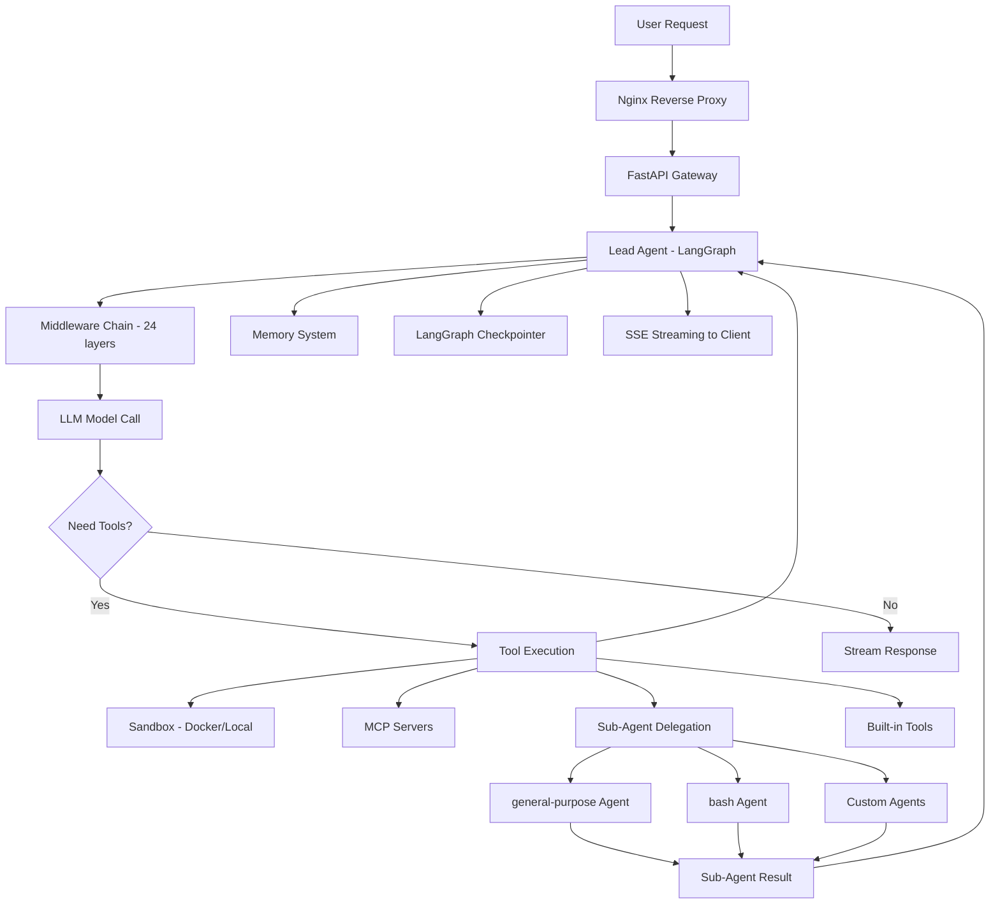
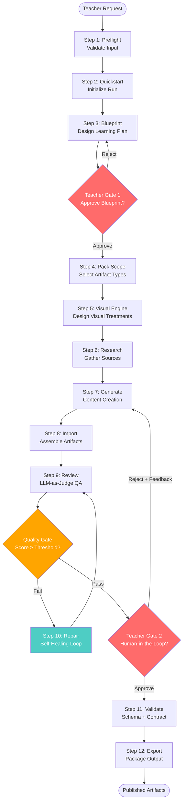
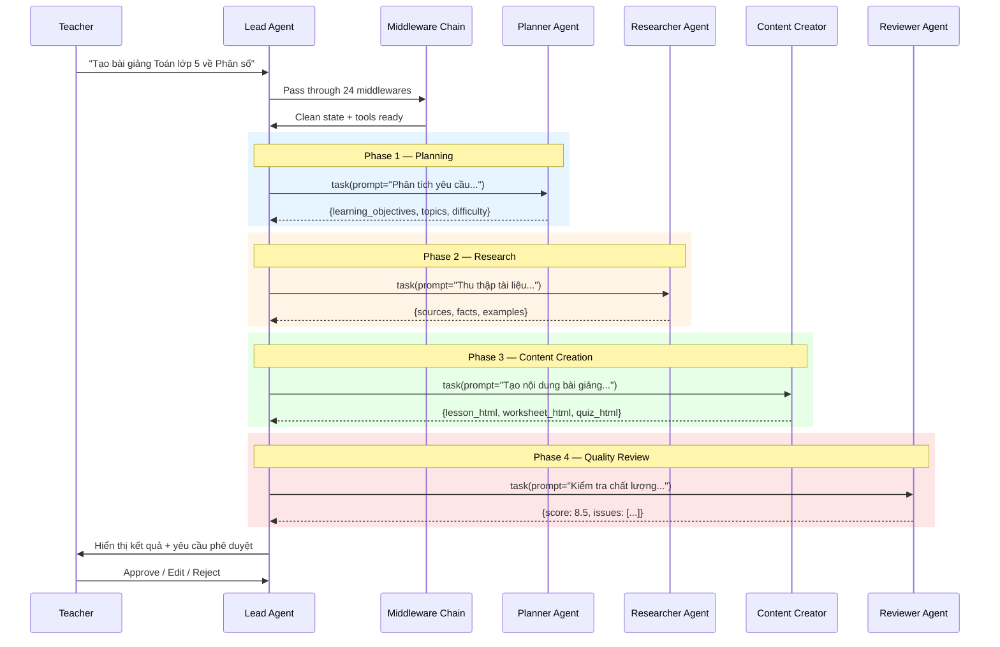

# Báo cáo Kỹ thuật 01: Kiến trúc Đa Đại lý (Multi-Agent Blueprint) trên DeerFlow 2.0

> **Mục tiêu**: Thiết kế kiến trúc multi-agent cho oh-my-class dựa trên phân tích sâu DeerFlow 2.0 (ByteDance) và các framework orchestration hiện đại.
>
> **Phiên bản**: 1.0 | **Ngày**: 2026-06-23

---

## Mục lục

1. [Tổng quan DeerFlow 2.0](#1-tổng-quan-deerflow-20)
2. [Sơ đồ Luồng dữ liệu & Tương tác Agents](#2-sơ-đồ-luồng-dữ-liệu--tương-tác-agents)
3. [Định nghĩa Chi tiết từng Agent](#3-định-nghĩa-chi-tiết-từng-agent)
4. [So sánh Frameworks Orchestration](#4-so-sánh-frameworks-orchestration)
5. [Thiết kế Multi-Agent cho oh-my-class](#5-thiết-kế-multi-agent-cho-oh-my-class)
6. [State Management & Persistence](#6-state-management--persistence)
7. [Middleware Chain — Nền tảng Orchestration](#7-middleware-chain--nền-tảng-orchestration)
8. [Khuyến nghị Kiến trúc](#8-khuyến-nghị-kiến-trúc)

---

## 1. Tổng quan DeerFlow 2.0

### 1.1 Repository & Stack

- **Repo**: `bytedance/deer-flow` — 73K+ stars, MIT License
- **Architecture**: LangGraph Supervisor → Homogeneous Subagents
- **Stack**: Python (LangGraph + LangChain) + Next.js frontend + Nginx reverse proxy

### 1.2 Kiến trúc Hệ thống

```
┌──────────────────────────────────────────────────────────┐
│                   Client (Browser)                        │
├──────────────────────────────────────────────────────────┤
│                  Nginx (Port 2026)                        │
│  /api/langgraph/*  →  Gateway (8001)                     │
│  /api/*            →  Gateway (8001)                     │
│  /*                →  Frontend Next.js (3000)            │
├──────────────────────────────────────────────────────────┤
│             Gateway API (FastAPI, Port 8001)               │
│  ┌────────────────────────────────────────────────────┐   │
│  │  Embedded Agent Runtime (LangGraph 1.0.6+)         │   │
│  │  ┌──────────┐ ┌──────────┐ ┌──────────────────┐    │   │
│  │  │ Lead     │ │Middleware│ │ Tools: Sandbox,   │    │   │
│  │  │ Agent    │ │ Chain    │ │ MCP, Community,   │    │   │
│  │  │(LangGraph)│ │ (24 layers)│ │ Subagents, Skills │    │   │
│  │  └──────────┘ └──────────┘ └──────────────────┘    │   │
│  └────────────────────────────────────────────────────┘   │
├──────────────────────────────────────────────────────────┤
│             Shared Configuration                           │
│  config.yaml  +  extensions_config.json                    │
└──────────────────────────────────────────────────────────┘
```

### 1.3 Quyết định Thiết kế Trọng tâm

| Quyết định | Lý do |
|-----------|-------|
| **Ground-up rewrite** — 2.0 chia sẻ 0 code với v1 | Thoát khỏi nợ kiến trúc; rebuild quanh LangGraph state machine |
| **"Harness" vs "Framework"** | Ships batteries-included: sandbox, memory, skills, subagents — không chỉ building blocks |
| **Agent runtime embedded trong Gateway** | Không cần LangGraph server riêng; Nginx rewrite `/api/langgraph/*` → Gateway's own `/api/*` |
| **Harness/App package split** | `deerflow.*` (publishable) never imports `app.*` — enforced by CI test |
| **Config-driven behavior** | Mọi thứ kiểm soát qua config.yaml; không cần thay đổi code |

### 1.4 Entry Point

```python
# File: packages/harness/deerflow/agents/lead_agent/agent.py

def make_lead_agent(config: RunnableConfig):
    """LangGraph graph factory; keep signature compatible with LangGraph Server."""
    runtime_config = _get_runtime_config(config)
    runtime_app_config = runtime_config.get("app_config")
    return _make_lead_agent(config, app_config=runtime_app_config or get_app_config())

def _make_lead_agent(config: RunnableConfig, *, app_config: AppConfig):
    cfg = _get_runtime_config(config)

    # Extract runtime config
    thinking_enabled = cfg.get("thinking_enabled", True)
    reasoning_effort = cfg.get("reasoning_effort", None)
    requested_model_name = cfg.get("model_name") or cfg.get("model")
    subagent_enabled = cfg.get("subagent_enabled", False)
    max_concurrent_subagents = cfg.get("max_concurrent_subagents", 3)

    # Tool assembly with skill-based filtering + deferred MCP tools
    raw_tools = get_available_tools(
        model_name=model_name,
        groups=agent_config.tool_groups if agent_config else None,
        subagent_enabled=subagent_enabled,
        app_config=resolved_app_config
    )

    return create_agent(
        model=create_chat_model(name=model_name, ...),
        tools=final_tools,
        middleware=build_middlewares(config, model_name=model_name, ...),
        system_prompt=apply_prompt_template(subagent_enabled=subagent_enabled, ...),
        state_schema=ThreadState,
    )
```

---

## 2. Sơ đồ Luồng dữ liệu & Tương tác Agents

### 2.1 Sơ đồ tổng — DeerFlow 2.0



### 2.2 Sơ đồ oh-my-class — 12-Step Run Lifecycle



### 2.3 Interaction Flow — Lead Agent → Sub-Agents



---

## 3. Định nghĩa Chi tiết từng Agent

### 3.1 Lead Agent (Supervisor/Orchestrator)

**Vai trò**: Không tạo nội dung — chỉ phân mảnh, điều phối, tổng hợp.

```python
LEAD_AGENT_CONFIG = {
    "name": "lead-agent",
    "description": """
        Supervisor agent cho hệ thống tạo tài liệu giáo dục oh-my-class.
        Nhiệm vụ: phân tích yêu cầu, phân mảnh task, điều phối sub-agents,
        tổng hợp kết quả, quản lý quality gates.
    """,
    "system_prompt": """
        Bạn là Lead Agent của oh-my-class — hệ thống quản lý lớp học và
        tạo tài liệu giáo dục tự động.

        ## Nguyên tắc
        1. KHÔNG BAO GIỜ tạo nội dung trực tiếp — delegate cho sub-agents
        2. LUÔN trả về dữ liệu cấu trúc (JSON) phục vụ render HTML
        3. Mỗi step phải hoàn thành trước khi sang step tiếp
        4. Teacher gate là BẮT BUỘC — không tự approve

        ## Quy trình 12 bước
        Preflight → Quickstart → Blueprint → Approval → Pack Scope →
        Visual Engine → Generate → Import → Review → Validate → Repair → Export

        ## Sub-agents khả dụng
        - planner: Thiết kế kế hoạch bài học
        - researcher: Thu thập tài liệu tham khảo
        - content-creator: Tạo nội dung HTML
        - reviewer: Kiểm tra chất lượng
    """,
    "tools": ["task", "ask_clarification", "read_file", "write_file"],
    "max_concurrent_subagents": 3,
}
```

### 3.2 Planner Agent

**Vai trò**: Phân tích yêu cầu, thiết kế learning outcomes, tạo blueprint.

```python
PLANNER_AGENT_CONFIG = {
    "name": "planner",
    "description": "Thiết kế kế hoạch bài học theo backward design (UbD)",
    "system_prompt": """
        Bạn là Planner Agent — chuyên gia thiết kế bài học.

        ## Xuất ra JSON với cấu trúc:
        {
            "topic": "string",
            "grade_level": "string (VD: 'Grade 5')",
            "subject": "string",
            "duration_minutes": number,
            "learning_objectives": [
                {
                    "id": "LO-001",
                    "bloom_level": "remember|understand|apply|analyze|evaluate|create",
                    "description": "string",
                    "assessment_method": "string"
                }
            ],
            "prerequisite_knowledge": ["string"],
            "learning_plan": {
                "phases": [
                    {
                        "name": "string (VD: 'Gagné Event 1: Gain Attention')",
                        "duration_minutes": number,
                        "activities": ["string"],
                        "materials": ["string"]
                    }
                ]
            },
            "assessment_checkpoints": [
                {
                    "type": "formative|summative",
                    "description": "string",
                    "timing": "string"
                }
            ]
        }

        ## Framework tham chiếu
        - Backward Design (UbD): Desired Results → Evidence → Learning Plan
        - Gagné's 9 Events of Instruction
        - Bloom's Taxonomy cho learning objectives
        -越南 2018 General Education Program (Chương trình GDPT 2018)
    """,
    "tools": ["web_search", "read_file"],
    "max_turns": 80,
    "output_schema": "LessonPlan",  # JSON Schema validation
}
```

### 3.3 Researcher Agent

**Vai trò**: Thu thập, xác thực, tổng hợp tài liệu tham khảo.

```python
RESEARCHER_AGENT_CONFIG = {
    "name": "researcher",
    "description": "Thu thập và xác thực tài liệu giáo dục từ nhiều nguồn",
    "system_prompt": """
        Bạn là Researcher Agent — chuyên gia thu thập tài liệu giáo dục.

        ## Nhiệm vụ
        1. Tìm kiếm tài liệu tham khảo cho topic được giao
        2. Xác thực tính chính xác qua cross-reference (≥2 nguồn)
        3. Trích xuất facts, examples, analogies phù hợp với grade level
        4. Tổng hợp thành cấu trúc JSON

        ## Xuất ra JSON:
        {
            "sources": [
                {
                    "url": "string",
                    "title": "string",
                    "credibility": "high|medium|low",
                    "key_facts": ["string"],
                    "relevance_score": number (0-1)
                }
            ],
            "synthesized_facts": [
                {
                    "fact": "string",
                    "evidence": ["string"],
                    "confidence": "verified|likely|uncertain",
                    "grade_appropriateness": "string"
                }
            ],
            "examples": [
                {
                    "type": "analogy|real-world|visual|mathematical",
                    "content": "string",
                    "target_concept": "string"
                }
            ]
        }

        ## Policies
        - basic: Tìm 2-3 nguồn, check factual accuracy
        - standard: Tìm 5+ nguồn, cross-reference, citation
        - rigorous: 10+ nguồn, peer-reviewed preferred, full audit trail
    """,
    "tools": ["web_search", "web_fetch", "read_file"],
    "max_turns": 80,
}
```

### 3.4 Content Creator Agent

**Vai trò**: Tạo nội dung HTML từ JSON data + templates.

```python
CONTENT_CREATOR_CONFIG = {
    "name": "content-creator",
    "description": "Tạo file HTML cho teaching pack (lesson, worksheet, quiz, drill, recap, infographic)",
    "system_prompt": """
        Bạn là Content Creator Agent — tạo nội dung HTML cho oh-my-class.

        ## Nguyên tắc CỐT LÕI
        1. LUÔN trả về structured JSON, KHÔNG viết raw HTML trực tiếp
        2. JSON sẽ được render qua Jinja2 templates
        3. Mỗi artifact type có schema riêng — tuân thủ tuyệt đối
        4. KHÔNG dùng CDN, external assets, unmanaged JS
        5. KHÔNG lưu student name/email/score — dùng generic labels

        ## Artifact Types
        - lesson: Bài giảng (HTML)
        - worksheet: Bài tập (HTML)
        - quiz: Kiểm tra trắc nghiệm (HTML)
        - drill: Luyện tập nhanh (HTML)
        - recap: Tổng ôn (HTML)
        - infographic: Đồ họa thông tin (HTML)
        - assessment-set: Bộ câu hỏi (JSON)

        ## Output Format
        {
            "artifact_type": "lesson|worksheet|quiz|drill|recap|infographic",
            "theme": "default|ocean|forest",
            "content": {
                "title": "string",
                "sections": [...],
                "metadata": {...}
            },
            "visual_elements": [...],
            "accessibility": {
                "language": "vi|en",
                "reading_level": "string",
                "alt_texts": {...}
            }
        }
    """,
    "tools": ["read_file", "write_file"],
    "max_turns": 120,
}
```

### 3.5 Reviewer Agent (Quality Gate)

**Vai trò**: Kiểm tra chất lượng nội dung trước khi xuất bản.

```python
REVIEWER_CONFIG = {
    "name": "reviewer",
    "description": "QA reviewer — kiểm tra chất lượng nội dung giáo dục",
    "system_prompt": """
        Bạn là Reviewer Agent — kiểm tra chất lượng nội dung giáo duty.

        ## Rubric Chấm điểm (3-Layer Evaluation)

        ### Layer 1: Format Compliance
        - doctype_present: bool
        - responsive: bool
        - no_external_assets: bool
        - brand_strings_present: bool

        ### Layer 2: Content Quality
        - accuracy: 0-10 (Factual correctness)
        - completeness: 0-10 (Coverage of learning objectives)
        - relevance: 0-10 (Age/grade appropriateness)
        - reasoning_quality: 0-10 (Logical flow)

        ### Layer 3: Presentation
        - readability: 0-10
        - engagement: 0-10
        - accessibility: 0-10

        ## Xuất ra JSON:
        {
            "overall_score": number,
            "passed": bool,
            "layer_scores": {
                "format": {...},
                "content": {...},
                "presentation": {...}
            },
            "issues": [
                {
                    "severity": "critical|warning|info",
                    "location": "string",
                    "description": "string",
                    "fix_suggestion": "string"
                }
            ],
            "recommendations": ["string"]
        }

        ## Hard Blocks (bắt buộc fail nếu vi phạm)
        - Thiếu doctype HTML
        - Dùng CDN/external assets
        - Answer key lọt vào student output
        - Dùng native radio/checkbox inputs
        - Unmanaged JS runtimes
    """,
    "tools": ["read_file"],
    "max_turns": 40,
}
```

---

## 4. So sánh Frameworks Orchestration

### 4.1 Ma trận So sánh Tổng quan

| Dimension | **LangGraph** | **CrewAI** | **AutoGen** | **DeerFlow** |
|---|---|---|---|---|
| **GitHub Stars** | Part of LangChain (100k+) | 51k+ | 55k+ (→AG2) | 73k+ |
| **Kiến trúc** | Stateful directed graphs | Role-based crews | Conversational agents | Super-agent harness on LangGraph |
| **Sequential workflows** | ✅ Native (linear edges) | ✅ `Process.sequential` | ✅ `SequentialGroupChat` | ✅ LangGraph-based |
| **Parallel execution** | ✅ `Send` API / fan-out | ⚠️ Limited | ✅ RoundRobin | ✅ Sub-agent fan-out |
| **Conditional branching** | ✅ `add_conditional_edges` | ⚠️ Router in Flows | ✅ GroupChat graph | ✅ LangGraph conditional |
| **Cyclic/loop workflows** | ✅ First-class | ❌ Must hack | ⚠️ Possible (risky) | ✅ LangGraph native |
| **State persistence** | ✅ Checkpointer (SQLite, Postgres) | ⚠️ Basic | ⚠️ Conversation memory | ✅ LangGraph + middleware |
| **Human-in-the-loop** | ✅ `interrupt()` native | ⚠️ `@human_feedback` | ⚠️ UserProxyAgent | ✅ Via LangGraph interrupts |
| **Error recovery** | ✅ Checkpoint resume | ❌ No built-in | ⚠️ Limited | ✅ Checkpointer-based |
| **LLM Caching** | ✅ LangChain cache | ❌ None built-in | ❌ None built-in | ✅ Via LangChain |
| **Cost control** | ✅ Predictable (graph) | ⚠️ +18% overhead | ❌ +31% overhead | ✅ Predictable |
| **Learning Curve** | High | Low | Medium | High (full system) |
| **Production Maturity** | ★★★★★ | ★★★☆ | ★★★ | ★★★★ |

### 4.2 Ước tính Chi phí (12-step pipeline + 4 approval gates)

| Framework | Avg tokens | Est. cost (GPT-4o) | Notes |
|---|---|---|---|
| **LangGraph** | ~12,000–18,000 | **$0.06–0.09** | Fixed graph = predictable |
| CrewAI | ~14,000–22,000 | $0.07–0.11 | ~18% overhead |
| AutoGen | ~16,000–28,000 | $0.08–0.14 | ~31% overhead, conversation bloat |

### 4.3 Khuyến nghị

**Sử dụng LangGraph làm framework orchestration.**

Lý do:
1. **12 sequential steps** → `add_edge(A, B)` — đơn giản, linear, predictable
2. **Mandatory human approval gates** → `interrupt()` pause EXACTLY at those steps
3. **Error recovery** → Checkpointer saves after every node. Crash → resume
4. **Parallel sub-agents** → `Send` API fans out to multiple workers
5. **Cost control** → Graph structure = predictable token consumption

---

## 5. Thiết kế Multi-Agent cho oh-my-class

### 5.1 Kiến trúc Tổng thể

```
┌────────────────────────────────────────────────────┐
│                  Lead Agent (Supervisor)            │
│  Phân mảnh → Điều phối → Tổng hợp → Quản lý Gate │
└──────────────────┬─────────────────────────────────┘
                   │
    ┌──────────────┼──────────────┬──────────────┐
    ▼              ▼              ▼              ▼
┌──────────┐ ┌──────────┐ ┌──────────┐ ┌──────────┐
│ Planner  │ │Researcher│ │ Content  │ │ Reviewer │
│ Agent    │ │ Agent    │ │ Creator  │ │ Agent    │
│          │ │          │ │ Agent    │ │          │
│ Design   │ │ Gather   │ │ Generate │ │ QA Check │
│ Blueprint│ │ Sources  │ │ HTML     │ │ Score    │
└──────────┘ └──────────┘ └──────────┘ └──────────┘
    │              │              │              │
    └──────────────┴──────────────┴──────────────┘
                   │
         ┌────────▼────────┐
         │   Sandbox Env   │
         │  (Docker/Local) │
         │  HTML rendering │
         │  Validation     │
         └─────────────────┘
```

### 5.2 State Schema cho Pipeline

```python
from typing import Annotated, NotRequired, TypedDict
from langgraph.graph import StateGraph, START, END
from langgraph.checkpoint.sqlite import SqliteSaver

class OhMyClassState(TypedDict):
    # ─── Phase 1: Input ───
    raw_request: str
    teacher_id: str
    class_info: dict  # {grade, subject, student_count}

    # ─── Phase 2: Planning ───
    lesson_plan: NotRequired[dict]
    blueprint_approved: bool
    revision_feedback: NotRequired[str]

    # ─── Phase 3: Research ───
    research_sources: NotRequired[list[dict]]
    synthesized_facts: NotRequired[list[dict]]

    # ─── Phase 4: Content Creation ───
    artifacts: Annotated[list[dict], merge_artifacts]
    artifact_types: list[str]  # ["lesson", "worksheet", "quiz"]

    # ─── Phase 5: Quality ───
    quality_scores: NotRequired[dict]
    quality_passed: bool
    teacher_approved: bool

    # ─── Phase 6: Export ───
    exported_files: Annotated[list[str], merge_artifacts]
    export_format: str  # "html", "gift", "h5p"

    # ─── Metadata ───
    current_step: int  # 1-12
    tokens_used: int
    revision_count: int
```

### 5.3 Graph Builder — Full Pipeline

```python
from langgraph.graph import StateGraph, START, END
from langgraph.checkpoint.sqlite import SqliteSaver
from langgraph.types import interrupt, Command, RetryPolicy
import sqlite3

def build_oh_my_class_graph():
    builder = StateGraph(OhMyClassState)

    # ─── Phase 1: Preflight & Setup ───
    builder.add_node("preflight", validate_input)
    builder.add_node("quickstart", initialize_run)

    # ─── Phase 2: Planning ───
    builder.add_node("blueprint", design_learning_plan,
                     retry=RetryPolicy(max_attempts=3))
    builder.add_node("blueprint_approval", teacher_gate_1)

    # ─── Phase 3: Research ───
    builder.add_node("pack_scope", select_artifact_types)
    builder.add_node("visual_engine", design_visual_treatments)
    builder.add_node("research", gather_sources,
                     retry=RetryPolicy(max_attempts=3))

    # ─── Phase 4: Content Creation ───
    builder.add_node("generate", create_content,
                     retry=RetryPolicy(max_attempts=3))
    builder.add_node("import_artifacts", assemble_artifacts)

    # ─── Phase 5: Quality Gates ───
    builder.add_node("review", llm_judge_review,
                     retry=RetryPolicy(max_attempts=2))
    builder.add_node("repair", self_healing_loop)
    builder.add_node("human_review", teacher_gate_2)

    # ─── Phase 6: Finalization ───
    builder.add_node("validate", schema_validation)
    builder.add_node("export", package_output)

    # ─── Edges ───
    builder.add_edge(START, "preflight")
    builder.add_edge("preflight", "quickstart")
    builder.add_edge("quickstart", "blueprint")
    builder.add_edge("blueprint", "blueprint_approval")

    # Conditional: approve → continue, reject → revise
    builder.add_conditional_edges("blueprint_approval",
        route_after_blueprint_approval,
        {"continue": "pack_scope", "revise": "blueprint"})

    builder.add_edge("pack_scope", "visual_engine")
    builder.add_edge("visual_engine", "research")
    builder.add_edge("research", "generate")
    builder.add_edge("generate", "import_artifacts")
    builder.add_edge("import_artifacts", "review")

    # Conditional: quality pass → human review, fail → repair
    builder.add_conditional_edges("review",
        route_after_quality_review,
        {"pass": "human_review", "fail": "repair"})

    builder.add_edge("repair", "review")  # Loop back for re-check

    # Conditional: human approve → validate, reject → regenerate
    builder.add_conditional_edges("human_review",
        route_after_human_review,
        {"approve": "validate", "revise": "generate"})

    builder.add_edge("validate", "export")
    builder.add_edge("export", END)

    # ─── Compile ───
    checkpointer = SqliteSaver(
        sqlite3.connect("ohmyclass_checkpoints.db", check_same_thread=False)
    )
    return builder.compile(checkpointer=checkpointer)
```

### 5.4 Teacher Gate Nodes

```python
def teacher_gate_1(state: OhMyClassState):
    """Blueprint Approval — Teacher phê duyệt kế hoạch bài học."""
    feedback = interrupt({
        "gate": "blueprint_approval",
        "lesson_plan": state["lesson_plan"],
        "question": "Phê duyệt kế hoạch bài học này?",
        "actions": ["approve", "edit", "reject"]
    })

    action = feedback.get("action", "approve")

    if action == "approve":
        return {"blueprint_approved": True}
    elif action == "edit":
        return {
            "blueprint_approved": True,
            "lesson_plan": feedback.get("edited_plan", state["lesson_plan"])
        }
    else:  # reject
        return {
            "blueprint_approved": False,
            "revision_feedback": feedback.get("feedback", "")
        }

def teacher_gate_2(state: OhMyClassState):
    """Human-in-the-Loop — Teacher duyệt nội dung đã tạo."""
    feedback = interrupt({
        "gate": "content_approval",
        "artifacts": state["artifacts"],
        "quality_scores": state["quality_scores"],
        "question": "Phê duyệt nội dung Teaching Pack?",
        "actions": ["approve", "edit", "reject"]
    })

    action = feedback.get("action", "approve")

    if action == "approve":
        return {"teacher_approved": True}
    elif action == "edit":
        return {
            "teacher_approved": True,
            "artifacts": feedback.get("edited_artifacts", state["artifacts"])
        }
    else:
        return {
            "teacher_approved": False,
            "revision_feedback": feedback.get("feedback", ""),
            "revision_count": state.get("revision_count", 0) + 1
        }
```

---

## 6. State Management & Persistence

### 6.1 ThreadState — DeerFlow Pattern

```python
from langgraph.graph import AgentState

class ThreadState(AgentState):
    """Extended state with custom reducers for concurrent updates."""

    # Sandbox isolation
    sandbox: Annotated[dict | None, merge_sandbox]

    # Artifact tracking (deduplicated)
    artifacts: Annotated[list[str], merge_artifacts]

    # Todo tracking (last non-None wins)
    todos: Annotated[list | None, merge_todos]

    # Thread metadata
    title: NotRequired[str | None]
    thread_data: NotRequired[dict | None]

# Custom reducers
def merge_sandbox(prev, new):
    """Fail closed if two different sandbox_ids collide."""
    if prev is None:
        return new
    if new is None:
        return prev
    if prev.get("sandbox_id") != new.get("sandbox_id"):
        raise ValueError("Sandbox ID conflict — different sandboxes in same thread")
    return new

def merge_artifacts(prev, new):
    """Deduplicated list preserving insertion order."""
    seen = set()
    result = []
    for item in (prev or []) + (new or []):
        if item not in seen:
            seen.add(item)
            result.append(item)
    return result

def merge_todos(prev, new):
    """Last non-None wins. None = 'didn't touch', [] = 'explicit clear'."""
    return new if new is not None else prev
```

### 6.2 Persistence Strategy

```
┌─────────────────────────────────────────────────┐
│              Persistence Layers                   │
├─────────────────────────────────────────────────┤
│ L1: In-Memory (MemorySaver)                      │
│   → Development, testing                         │
│   → Lost on restart                              │
├─────────────────────────────────────────────────┤
│ L2: SQLite (SqliteSaver)                         │
│   → Single-instance production                   │
│   → File: ohmyclass_checkpoints.db               │
├─────────────────────────────────────────────────┤
│ L3: PostgreSQL (PostgresSaver)                   │
│   → Multi-instance, cloud deployment             │
│   → concurrent.futures-safe                      │
├─────────────────────────────────────────────────┤
│ L4: Redis + PostgreSQL                           │
│   → High-throughput production                   │
│   → Redis for fast state, PG for durability      │
└─────────────────────────────────────────────────┘
```

---

## 7. Middleware Chain — Nền tảng Orchestration

### 7.1 DeerFlow Middleware Chain (24 layers)

| # | Middleware | Mục đích | oh-my-class Analog |
|---|-----------|---------|-------------------|
| 1 | InputSanitization | Sanitize inputs | Preflight validation |
| 2 | ToolOutputBudget | Prevent oversized tool results | Context management |
| 3 | ThreadData | Create per-thread dirs | Run directory setup |
| 4 | Uploads | Track uploaded files | Source file tracking |
| 5 | Sandbox | Acquire sandbox | Docker/K8s sandbox |
| 6 | DanglingToolCall | Fix orphan tool calls | Crash recovery |
| 7 | LLMErrorHandling | Handle provider errors | Retry + fallback |
| 8 | Guardrail | Content filtering | Content safety |
| 9 | SandboxAudit | Audit sandbox ops | Security logging |
| 10 | ToolErrorHandling | Convert exceptions | Error propagation |
| 11 | DynamicContext | Inject date + memory | Context injection |
| 12 | SkillActivation | `/skill-name` loading | Step activation |
| 13 | Summarization | Context compression | Token management |
| 14 | Todo | Plan-mode tracking | Step tracking |
| 15 | TokenUsage | Collect token counts | Cost tracking |
| 16 | Title | Auto-generate titles | Run naming |
| 17 | Memory | Memory extraction | Knowledge persistence |
| 18 | ViewImage | Vision model processing | Image handling |
| 19 | DeferredToolFilter | Hide deferred tools | Tool management |
| 20 | SubagentLimit | Enforce max concurrent | Parallelism control |
| 21 | LoopDetection | Hash + frequency detection | Infinite loop prevention |
| 22 | TokenBudget | Per-run budget | Cost ceiling |
| 23 | SafetyFinishReason | Suppress truncated calls | Safety net |
| 24 | Clarification | Intercept clarification | **MUST BE LAST** |

### 7.2 Loop Detection — Critical Safety Pattern

```python
# DeerFlow's Loop Detection (612 lines)
# Two detection layers:
#
# 1. Hash-based: Hashes (name + normalized args) of tool-call sets
#    → warn at 3, hard-stop at 5
#
# 2. Frequency-based: Counts per-tool-type calls across varying args
#    → warn at 30, hard-stop at 50

_DEFAULT_WARN_THRESHOLD = 3    # inject "you're repeating" warning
_DEFAULT_HARD_LIMIT = 5        # strip all tool_calls, force text answer
_DEFAULT_WINDOW_SIZE = 20      # sliding window of recent tool call hashes
```

### 7.3 Dangling Tool Call — Crash Recovery

```python
# When user interrupts mid-tool-call, next request has AIMessages
# with tool_calls but no matching ToolMessages — crashes OpenAI/Moonshot.
# Fix: insert synthetic ToolMessage[status=error]

def _build_patched_messages(self, messages: list) -> list | None:
    for tc in self._message_tool_calls(msg):
        tc_id = tc.get("id")
        existing_tool_msg = tool_messages_by_id.get(tc_id)
        if existing_tool_msg is not None:
            patched.append(existing_tool_msg)
        else:
            patched.append(ToolMessage(
                content="[Tool call was interrupted and did not return a result.]",
                tool_call_id=tc_id,
                name=tc.get("name", "unknown"),
                status="error",
            ))
```

---

## 8. Khuyến nghị Kiến trúc

### 8.1 Quyết định Cuối cùng

| Hạng mục | Khuyến nghị | Lý do |
|---------|-------------|-------|
| **Framework** | LangGraph | Best for sequential pipeline + HITL + persistence |
| **Orchestration Pattern** | Supervisor Pattern | Lead Agent → 4 specialized sub-agents |
| **State Persistence** | SQLite (dev) → PostgreSQL (prod) | Progressive scaling |
| **Human-in-the-Loop** | `interrupt()` + Webhook | Native LangGraph, battle-tested |
| **Error Recovery** | Checkpointer + RetryPolicy | Crash-safe, auto-retry |
| **Cost Control** | TokenBudget middleware + DeepSeek routing | 77% savings vs GPT-4o only |

### 8.2 DeerFlow Patterns worth emulating

1. **Middleware Chain** — 24 single-concern layers, each file ~200 lines
2. **Loop Detection** — Hash + frequency dual-layer
3. **Dangling Tool Call** — Crash recovery for interrupted tool calls
4. **Subagent Isolation** — Filtered tools per sub-agent type
5. **Config-Driven Behavior** — YAML controls everything, no code changes
6. **Skill System** — Markdown files injected into system prompt
7. **Deferred Tool Loading** — Tool schemas loaded only when needed

### 8.3 Tóm tắt

DeerFlow 2.0 chứng minh rằng **LangGraph là nền tảng production-viable cho multi-agent systems phức tạp**. oh-my-class nên:

1. **Xây trên LangGraph** — không cần reinvent wheel
2. **Học middleware pattern từ DeerFlow** — 24 single-concern layers
3. **Sử dụng Supervisor Pattern** — Lead Agent orchestrate, không generate
4. **Teacher Gate là interrupt()** — LangGraph native, state persists
5. **Sub-agent isolation** — Mỗi agent có tools riêng, không overlap

---

> **Nguồn tham khảo**:
> - DeerFlow 2.0: https://github.com/bytedance/deer-flow
> - LangGraph Documentation: https://docs.langchain.com/oss/python/langgraph
> - LangGraph Interrupts: https://docs.langchain.com/oss/python/langgraph/interrupts
> - Multi-Agent Comparison: https://www.langchain.com/blog/choosing-the-right-multi-agent-architecture
> - Benchmark: https://agent-harness.ai/blog/multi-agent-orchestration-frameworks-benchmark
