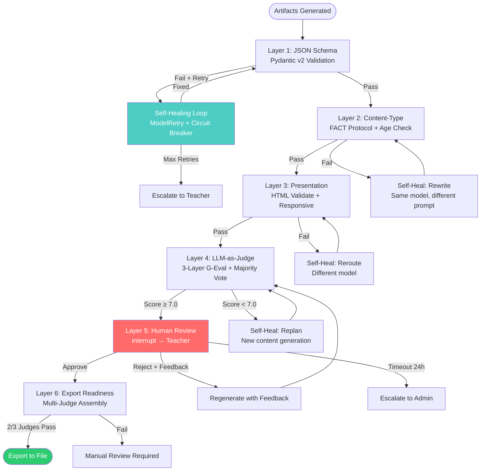

# Báo cáo Kỹ thuật 02: Hệ thống Gate & Harnessing Flow

> **Mục tiêu**: Thiết kế và hiện thực hóa cơ chế Quality Gates cho oh-my-class — bao gồm LLM-as-a-Judge, Human-in-the-Loop, và Self-Healing Loops.
>
> **Phiên bản**: 1.0 | **Ngày**: 2026-06-23

---

## Mục lục

1. [Tổng quan Quality Gate System](#1-tổng-quan-quality-gate-system)
2. [Layer 1: JSON Schema Validation](#2-layer-1-json-schema-validation)
3. [Layer 2: Content-Type Rules](#3-layer-2-content-type-rules)
4. [Layer 3: Presentation Contract](#4-layer-3-presentation-contract)
5. [Layer 4: LLM-as-a-Judge (Gate Rules)](#5-layer-4-llm-as-a-judge)
6. [Layer 5: Human-in-the-Loop (Artifact Review)](#6-layer-5-human-in-the-loop)
7. [Layer 6: Export Readiness](#7-layer-6-export-readiness)
8. [Self-Healing Loop trong Sandbox](#8-self-healing-loop-trong-sandbox)
9. [Harnessing Flow — Tổng hợp](#9-harnessing-flow--tổng-hợp)

---

## 1. Tổng quan Quality Gate System

### 1.1 Kiến trúc 6-Layer Gate

```
┌─────────────────────────────────────────────────────┐
│                  Layer 6: Export Readiness            │
│  Multi-judge assembly (3 independent judge calls)    │
│  + calibration check against teacher labels          │
├─────────────────────────────────────────────────────┤
│                  Layer 5: Artifact Review             │
│  LangGraph interrupt() — approve/edit/reject         │
│  Webhook notification → teacher dashboard            │
│  Async resume via Command(resume=...)                 │
│  Timeout: auto-escalate after 24h                    │
├─────────────────────────────────────────────────────┤
│                  Layer 4: Gate Rules                  │
│  LLM-as-Judge: 3-layer (format/content/expression)   │
│  Weighted scoring across 9 metrics                   │
│  Majority vote over 3 judge repeats                  │
├─────────────────────────────────────────────────────┤
│                  Layer 3: Presentation Contract       │
│  Format compliance judge (Layer 1)                   │
│  HTML/CSS validity checker (deterministic)           │
│  Responsive breakpoint checks (Playwright)           │
├─────────────────────────────────────────────────────┤
│                  Layer 2: Content-Type Rules           │
│  FACT hallucination detection protocol               │
│  Age-appropriateness checker                         │
│  Academic accuracy verification (≥2 sources)         │
├─────────────────────────────────────────────────────┤
│                  Layer 1: JSON Schema                  │
│  Pydantic v2 / JSON Schema validation               │
│  Self-healing: ModelRetry on validation failure      │
│  Circuit breaker: max 3 retries, then escalate       │
└─────────────────────────────────────────────────────┘
```

### 1.2 Mapping với oh-my-class Run Lifecycle

| Run Step | Gate Layer | Technology |
|----------|-----------|------------|
| Step 8: Import | Layer 1 | Pydantic v2 + Zod v4 |
| Step 9: Review | Layer 2-3 | FACT protocol + HTML validate |
| Step 9: Review | Layer 4 | LLM-as-Judge (G-Eval) |
| Step 10: Repair | Self-Healing | Retry + ModelRetry |
| Step 9: Review | Layer 5 | `interrupt()` → Teacher |
| Step 11: Validate | Layer 6 | Multi-judge assembly |

---

## 2. Layer 1: JSON Schema Validation

### 2.1 Pydantic v2 Validators

```python
from pydantic import BaseModel, Field, field_validator, model_validator
from typing import Literal

class LearningObjective(BaseModel):
    id: str = Field(pattern=r"^LO-\d{3}$")
    bloom_level: Literal["remember", "understand", "apply", "analyze", "evaluate", "create"]
    description: str = Field(min_length=10, max_length=200)
    assessment_method: str = Field(min_length=5)

    @field_validator("description")
    @classmethod
    def validate_no_placeholders(cls, v: str) -> str:
        """Phát hiện placeholder content từ LLM."""
        placeholders = ["[TBD]", "[TODO]", "lorem ipsum", "example text"]
        if any(p.lower() in v.lower() for p in placeholders):
            raise ValueError(f"Content contains placeholder: {v[:50]}...")
        return v

class LessonPlan(BaseModel):
    topic: str = Field(min_length=3, max_length=100)
    grade_level: str = Field(pattern=r"^Grade \d{1,2}$")
    subject: str
    duration_minutes: int = Field(ge=10, le=180)
    learning_objectives: list[LearningObjective] = Field(min_length=1, max_length=10)
    prerequisite_knowledge: list[str] = Field(default_factory=list)
    learning_plan: dict
    assessment_checkpoints: list[dict] = Field(min_length=1)

    @model_validator(mode="after")
    def validate_bloom_coverage(self) -> "LessonPlan":
        """Đảm bảo至少覆盖 2 cấp Bloom's taxonomy."""
        levels = {obj.bloom_level for obj in self.learning_objectives}
        if len(levels) < 2:
            raise ValueError(
                f"Learning objectives must cover ≥2 Bloom's levels. "
                f"Currently only: {levels}"
            )
        return self

class ArtifactContent(BaseModel):
    artifact_type: Literal["lesson", "worksheet", "quiz", "drill", "recap", "infographic"]
    theme: str = Field(default="default")
    title: str = Field(min_length=3, max_length=200)
    sections: list[dict] = Field(min_length=1)
    metadata: dict = Field(default_factory=dict)

    @field_validator("title")
    @classmethod
    def validate_no_answer_leakage(cls, v: str) -> str:
        """Kiểm tra answer key không bị lọt vào title."""
        suspicious = ["answer", "đáp án", "solution", "key"]
        if any(s in v.lower() for s in suspicious):
            raise ValueError("Title may contain answer key — check student/teacher view separation")
        return v
```

### 2.2 Self-Healing với Pydantic AI ModelRetry

```python
from pydantic_ai import Agent, ModelRetry

content_agent = Agent("deepseek-v4-flash", result_type=ArtifactContent)

@content_agent.output_validator
def validate_content(ctx, result: ArtifactContent) -> ArtifactContent:
    """Tự động retry nếu output không hợp lệ."""
    if len(result.sections) == 0:
        raise ModelRetry("No sections found — content may be empty or malformed")

    if result.artifact_type == "quiz":
        for i, section in enumerate(result.sections):
            if "questions" not in section:
                raise ModelRetry(f"Section {i} missing 'questions' field for quiz artifact")

    return result

# Usage: Agent sẽ tự retry nếu validation fail
result = content_agent.run_sync("Tạo bài kiểm tra về Phân số lớp 5")
# result.data = ArtifactContent (validated)
```

### 2.3 Circuit Breaker Pattern

```python
import time
import random

class CircuitBreaker:
    def __init__(self, threshold: int = 3, recovery_timeout: float = 30.0):
        self.failures = 0
        self.threshold = threshold
        self.state = "closed"  # closed → open → half-open
        self.last_failure = 0
        self.recovery_timeout = recovery_timeout

    def call(self, fn, *args, **kwargs):
        if self.state == "open":
            if time.time() - self.last_failure > self.recovery_timeout:
                self.state = "half-open"
            else:
                raise CircuitBreakerOpen(f"Circuit open — retry after {self.recovery_timeout}s")

        try:
            result = fn(*args, **kwargs)
            self.failures = 0
            self.state = "closed"
            return result
        except Exception as e:
            self.failures += 1
            self.last_failure = time.time()
            if self.failures >= self.threshold:
                self.state = "open"
            raise

# Usage trong validation pipeline
schema_breaker = CircuitBreaker(threshold=3, recovery_timeout=60.0)

def validate_with_breaker(artifact: dict) -> LessonPlan:
    return schema_breaker.call(lambda: LessonPlan(**artifact))
```

---

## 3. Layer 2: Content-Type Rules

### 3.1 FACT Hallucination Detection Protocol

```
F — Find the claim        Identify every factual assertion
A — Assess the risk       Is it specific enough to be wrong?
C — Cross-reference       Verify against ≥2 independent authoritative sources
T — Tag the result        VERIFIED / MODIFIED / REMOVED
```

```python
from pydantic import BaseModel

class FactCheck(BaseModel):
    claim: str
    risk_level: str  # "high" | "medium" | "low"
    sources_checked: list[str]
    status: str  # "VERIFIED" | "MODIFIED" | "REMOVED" | "UNCERTAIN"
    confidence: float  # 0-1
    correction: str | None = None

class ContentFactCheck(BaseModel):
    total_claims: int
    verified: int
    modified: int
    removed: int
    uncertain: int
    fact_checks: list[FactCheck]

    @property
    def pass_rate(self) -> float:
        """Tỷ lệ claims được xác minh."""
        return (self.verified + self.modified) / max(self.total_claims, 1)

    @property
    def has_unverified(self) -> bool:
        """Kiểm tra còn claim nào chưa được xác minh."""
        return self.uncertain > 0 or self.removed > 0

# FACT Protocol Implementation
FACT_SYSTEM_PROMPT = """
Bạn là FACT Hallucination Detector. Nhiệm vụ: kiểm tra từng factual claim trong nội dung.

Quy trình:
1. F — Liệt kê MỖI factual assertion trong nội dung
2. A — Đánh giá risk level:
   - HIGH: Con số cụ thể, tên riêng, sự kiện lịch sử, công thức
   - MEDIUM: Khái niệm khoa học, định nghĩa
   - LOW: Mô tả chung, ý kiến
3. C — Cross-reference với ≥2 nguồn authoritative
4. T — Gắn tag: VERIFIED / MODIFIED / REMOVED / UNCERTAIN

Rules:
- Nếu content là "Phân số là một phần của số nguyên" → VERIFIED (mathematical fact)
- Nếu content là "Đại số được phát minh bởi al-Khwarizmi năm 820" → check sources
- Nếu content chứa placeholder "[TBD]" → REMOVED
- Nếu không thể verify → UNCERTAIN

Output JSON: ContentFactCheck schema
"""
```

### 3.2 Age-Appropriateness Checker

```python
AGE_BANDS = {
    "primary_1_2": {"grades": "1-2", "age_range": "6-7",
                     "forbidden": ["violence", "complex_abstractions", "political"]},
    "primary_3_5": {"grades": "3-5", "age_range": "8-10",
                     "forbidden": ["sexual_content", "extreme_violence", "complex_politics"]},
    "lower_secondary": {"grades": "6-9", "age_range": "11-14",
                         "forbidden": ["explicit_sexual", "graphic_violence"]},
    "upper_secondary": {"grades": "10-12", "age_range": "15-17",
                         "forbidden": ["extreme_graphic"]},
}

def check_age_appropriateness(content: str, grade_level: str) -> list[str]:
    """Kiểm tra nội dung có phù hợp với độ tuổi không."""
    issues = []
    # Extract grade number
    grade_num = int("".join(filter(str.isdigit, grade_level)))

    if grade_num <= 2:
        band = AGE_BANDS["primary_1_2"]
    elif grade_num <= 5:
        band = AGE_BANDS["primary_3_5"]
    elif grade_num <= 9:
        band = AGE_BANDS["lower_secondary"]
    else:
        band = AGE_BANDS["upper_secondary"]

    # Check reading level (Flesch-Kincaid approximation)
    words = content.split()
    sentences = content.count('.') + content.count('!') + content.count('?')
    avg_words_per_sentence = len(words) / max(sentences, 1)

    if grade_num <= 5 and avg_words_per_sentence > 15:
        issues.append(f"Sentence too complex for grade {grade_num}: avg {avg_words_per_sentence:.1f} words/sentence")

    return issues
```

### 3.3 Binary Pedagogical Metrics

```python
from pydantic import BaseModel

class PedagogicalMetrics(BaseModel):
    """7-Binary-Metric Pattern từ Nepal K-10 curriculum study."""
    prompt_alignment: bool  # Output match instructional prompt?
    factual_correctness: bool  # All statements accurate?
    clarity: bool  # Student can understand this?
    contextual_relevance: bool  # Culturally/contextually appropriate?
    engagement: bool  # Maintains learner interest?
    harmful_content_avoidance: bool  # No safety issues?
    solution_accuracy: bool  # Final answer correct?

    @property
    def overall_pass(self) -> bool:
        """All 7 metrics must pass."""
        return all([
            self.prompt_alignment,
            self.factual_correctness,
            self.clarity,
            self.contextual_relevance,
            self.engagement,
            self.harmful_content_avoidance,
            self.solution_accuracy,
        ])

    @property
    def fail_count(self) -> int:
        return sum(1 for v in self.model_dump().values() if v is False)

# Research finding: Binary metrics achieve higher inter-rater reliability
# than Likert scales, and produce more actionable diagnostics.
```

---

## 4. Layer 3: Presentation Contract

### 4.1 HTML Validation

```python
import subprocess
from pathlib import Path

class PresentationValidator:
    """Validate HTML output theo presentation contract."""

    def validate_doctype(self, html_content: str) -> list[str]:
        issues = []
        if not html_content.strip().startswith("<!DOCTYPE html>"):
            issues.append("CRITICAL: Missing <!DOCTYPE html>")
        return issues

    def validate_external_assets(self, html_content: str) -> list[str]:
        issues = []
        forbidden_patterns = [
            (r'<link\s+href="https?://', "External CSS CDN detected"),
            (r'<script\s+src="https?://', "External JS CDN detected"),
            (r'@import\s+url\("https?://', "External @import detected"),
            (r' list[str]:
        """Đảm bảo answer key không lọt vào student view."""
        issues = []
        if artifact_type in ["quiz", "worksheet", "drill"]:
            # Check for visible answer sections
            import re
            answer_patterns = [
                r'class="[^"]*answer[^"]*"[^>]*>\s*[^<]+',  # Visible answer div
                r'data-answer="[^"]+"',  # Data attribute (can be scraped)
            ]
            for pattern in answer_patterns:
                if re.search(pattern, html_content, re.IGNORECASE):
                    issues.append("WARNING: Possible answer key leakage in student view")
                    break
        return issues

    def validate_responsive(self, html_content: str) -> list[str]:
        """Kiểm tra responsive design basics."""
        issues = []
        if "viewport" not in html_content.lower():
            issues.append("WARNING: Missing viewport meta tag")
        if "max-width" not in html_content and "min-width" not in html_content:
            issues.append("INFO: No responsive CSS breakpoints detected")
        return issues

    def validate_brand_strings(self, html_content: str, brand_config: dict) -> list[str]:
        """Kiểm tra brand strings có mặt."""
        issues = []
        required_strings = brand_config.get("required_strings", ["oh-my-class"])
        for s in required_strings:
            if s.lower() not in html_content.lower():
                issues.append(f"WARNING: Brand string '{s}' not found in output")
        return issues
```

### 4.2 Responsive Breakpoint Check (Playwright)

```python
from playwright.sync_api import sync_playwright

VIEWPORTS = [
    {"name": "mobile", "width": 375, "height": 812},
    {"name": "tablet", "width": 768, "height": 1024},
    {"name": "desktop", "width": 1280, "height": 800},
    {"name": "wide", "width": 1920, "height": 1080},
]

def check_responsive_rendering(html_path: str) -> dict[str, dict]:
    """Render HTML ở nhiều viewport, chụp screenshot, kiểm tra."""
    results = {}

    with sync_playwright() as p:
        browser = p.chromium.launch(headless=True)

        for viewport in VIEWPORTS:
            page = browser.new_page(
                viewport={"width": viewport["width"], "height": viewport["height"]}
            )
            page.goto(f"file://{html_path}")

            # Check for horizontal scroll
            has_hscroll = page.evaluate(
                "document.documentElement.scrollWidth > document.documentElement.clientWidth"
            )

            # Check text visibility
            visible_text = page.evaluate("document.body.innerText.length")

            # Check for overlapping elements
            overflow_count = page.evaluate("""
                () => {
                    let count = 0;
                    document.querySelectorAll('*').forEach(el => {
                        const rect = el.getBoundingClientRect();
                        if (rect.right > window.innerWidth) count++;
                    });
                    return count;
                }
            """)

            results[viewport["name"]] = {
                "has_horizontal_scroll": has_hscroll,
                "visible_text_length": visible_text,
                "overflow_elements": overflow_count,
                "pass": not has_hscroll and overflow_count == 0,
            }

            page.close()

        browser.close()

    return results

# Usage
# results = check_responsive_rendering("/tmp/output/lesson.html")
# assert all(r["pass"] for r in results.values()), "Responsive check failed"
```

---

## 5. Layer 4: LLM-as-a-Judge

### 5.1 G-Eval Protocol — 3-Layer Separated Evaluation

```python
from pydantic import BaseModel, Field

class LayerScore(BaseModel):
    rationale: str = Field(description="Phân tích trước khi chấm điểm")
    score: float = Field(ge=0, le=10)

class JudgeOutput(BaseModel):
    """Structured output từ LLM Judge."""
    layer_1_format: LayerScore  # Format compliance
    layer_2_content: LayerScore  # Content quality
    layer_3_presentation: LayerScore  # Presentation quality

    # Specific metrics within each layer
    accuracy: float = Field(ge=0, le=10)
    completeness: float = Field(ge=0, le=10)
    relevance: float = Field(ge=0, le=10)
    readability: float = Field(ge=0, le=10)
    engagement: float = Field(ge=0, le=10)
    accessibility: float = Field(ge=0, le=10)

    @property
    def overall_score(self) -> float:
        """Weighted average across 3 layers."""
        return (
            self.layer_1_format.score * 0.15 +
            self.layer_2_content.score * 0.55 +
            self.layer_3_presentation.score * 0.30
        )

    @property
    def passed(self) -> bool:
        """Pass if overall ≥ 7.0 AND no critical issues."""
        return self.overall_score >= 7.0

# G-Eval System Prompt
GEVAL_SYSTEM_PROMPT = """
Bạn là Quality Judge cho nội dung giáo dục. Đánh giá theo 3 Layer:

## Layer 1: Format Compliance (15%)
- Có DOCTYPE HTML không?
- Responsive (viewport meta, media queries)?
- Không dùng CDN/external assets?
- Brand strings có mặt?

## Layer 2: Content Quality (55%)
- accuracy: Nội dung chính xác về mặt học thuật?
- completeness: Đầy đủ learning objectives?
- relevance: Phù hợp với grade level?
- reasoning_quality: Luồng logic hợp lý?

## Layer 3: Presentation (30%)
- readability: Dễ đọc, dễ hiểu?
- engagement: Thu hút học sinh?
- accessibility: WCAG compliance?

## QUAN TRỌNG
1. LUÔN viết rationale TRƯỚC khi chấm điểm (think-before-score)
2. Boolean scoring > Likert khi có thể
3. Trích dẫn cụ thể từ nội dung làm evidence
4. KHÔNG bao giờ chấm điểm dài hơn = điểm cao hơn

Output theo JudgeOutput JSON schema.
"""
```

### 5.2 Judge Implementation

```python
import openai
import json

class LLMJudge:
    """3-Layer Separated LLM-as-Judge."""

    def __init__(self, model: str = "gpt-5.4"):
        self.client = openai.OpenAI(
            api_key="sk-oh-my-class-gate-key",
            base_url="http://localhost:4000"  # LiteLLM proxy
        )
        self.model = model

    def judge(self, artifact: dict, rubric_version: str = "1.0") -> JudgeOutput:
        """Chấm điểm artifact qua 3-layer evaluation."""
        response = self.client.chat.completions.create(
            model=self.model,
            messages=[
                {"role": "system", "content": GEVAL_SYSTEM_PROMPT},
                {"role": "user", "content": f"Đánh giá artifact:\n{json.dumps(artifact, indent=2, ensure_ascii=False)}"}
            ],
            response_format={"type": "json_object"},
            temperature=0.1,  # Low temp for consistent scoring
        )

        result = json.loads(response.choices[0].message.content)
        return JudgeOutput(**result)

    def judge_with_majority_vote(self, artifact: dict, n_judges: int = 3) -> JudgeOutput:
        """Majority vote qua nhiều judge calls để giảm bias."""
        judges = [self.judge(artifact) for _ in range(n_judges)]

        # Average scores
        avg_overall = sum(j.overall_score for j in judges) / len(judges)

        # Majority vote on pass/fail
        pass_votes = sum(1 for j in judges if j.passed)
        majority_passed = pass_votes > len(judges) / 2

        # Use the median judge's detailed output
        sorted_judges = sorted(judges, key=lambda j: j.overall_score)
        median_judge = sorted_judges[len(sorted_judges) // 2]

        # Override with averaged scores
        median_judge.layer_1_format.score = sum(j.layer_1_format.score for j in judges) / len(judges)
        median_judge.layer_2_content.score = sum(j.layer_2_content.score for j in judges) / len(judges)
        median_judge.layer_3_presentation.score = sum(j.layer_3_presentation.score for j in judges) / len(judges)

        return median_judge

# Usage
judge = LLMJudge(model="gpt-5.4")
result = judge.judge_with_majority_vote(artifact_content, n_judges=3)

if not result.passed:
    print(f"FAILED: overall_score={result.overall_score:.1f}")
    print(f"Issues: {result.layer_2_content.rationale}")
```

### 5.3 Bias Mitigation

| Bias | Mitigation | Implementation |
|------|-----------|----------------|
| **Position bias** | Blind evaluation (randomize A/B order) | `judge_pairwise()` scores A and B independently |
| **Verbosity bias** | Explicit guard in rubric | "Do not rate longer answers higher" |
| **Self-enhancement** | Different model for judge vs generator | Generator: DeepSeek, Judge: GPT-5.4 |
| **Sycophancy** | Rationale-before-score ordering | `rationale` field emitted before `score` |
| **Style bias** | Layer-separated evaluation | Isolates expression from content |

### 5.4 Calibration Workflow

```python
import pandas as pd
from sklearn.metrics import cohen_kappa_score

def calibrate_judge(judge_results: list[dict], human_labels: list[dict]) -> float:
    """Calibrate LLM judge against human teacher labels."""
    # Extract scores
    judge_scores = [r["passed"] for r in judge_results]
    human_scores = [h["passed"] for h in human_labels]

    # Compute Cohen's kappa
    kappa = cohen_kappa_score(judge_scores, human_scores)

    print(f"Cohen's Kappa: {kappa:.3f}")
    if kappa >= 0.6:
        print("✅ Judge is calibrated (κ ≥ 0.6)")
    elif kappa >= 0.4:
        print("⚠️ Judge needs refinement (0.4 ≤ κ < 0.6)")
    else:
        print("❌ Judge not calibrated (κ < 0.4) — refine rubric")

    return kappa

# Production calibration workflow:
# 1. Collect 50-200 human-graded examples
# 2. Run LLM judge on same examples
# 3. Compute Cohen's kappa (target: κ ≥ 0.6)
# 4. If below threshold: refine rubric, adjust anchors
# 5. Re-run until acceptable
```

---

## 6. Layer 5: Human-in-the-Loop

### 6.1 LangGraph interrupt() Pattern

```python
from langgraph.types import interrupt

def human_review_gate(state: OhMyClassState):
    """Pause execution và chờ teacher review."""
    response = interrupt({
        "gate": "content_approval",
        "artifacts": state["artifacts"],
        "quality_scores": state["quality_scores"],
        "revision_count": state.get("revision_count", 0),
        "actions": ["approve", "edit", "reject"],
        "question": "Phê duyệt Teaching Pack này?"
    })

    # Parse response
    if isinstance(response, str):
        response = {"action": response}

    action = (response.get("action") or "approve").lower()

    if action == "edit":
        return {
            "teacher_approved": True,
            "artifacts": response.get("content", state["artifacts"]),
        }
    elif action == "reject":
        return {
            "teacher_approved": False,
            "revision_feedback": response.get("feedback", ""),
            "revision_count": state.get("revision_count", 0) + 1,
        }
    else:  # approve
        return {"teacher_approved": True}
```

### 6.2 Async Webhook-Based Approval

```python
import httpx
from datetime import datetime

class WebhookApprovalNotifier:
    """Gửi webhook notification cho teacher khi cần approve."""

    def __init__(self, webhook_url: str):
        self.webhook_url = webhook_url

    async def notify_teacher(
        self,
        thread_id: str,
        artifacts: list[dict],
        quality_scores: dict,
    ) -> dict:
        """Gửi approval request qua webhook."""
        payload = {
            "event": "approval_required",
            "thread_id": thread_id,
            "timestamp": datetime.utcnow().isoformat(),
            "artifacts_summary": [
                {
                    "type": a.get("artifact_type"),
                    "title": a.get("title"),
                    "quality_score": quality_scores.get(a.get("artifact_type"), "N/A"),
                }
                for a in artifacts
            ],
            "actions_url": f"https://oh-my-class.app/approve/{thread_id}",
            "expires_at": datetime.utcnow().isoformat(),  # 24h TTL
        }

        async with httpx.AsyncClient() as client:
            response = await client.post(self.webhook_url, json=payload)
            return {"status": response.status_code, "sent": response.status_code == 200}

# Telegram/Zalo integration
class TelegramApprovalNotifier:
    """Gửi approval request qua Telegram."""

    def __init__(self, bot_token: str, chat_id: str):
        self.bot_token = bot_token
        self.chat_id = chat_id

    async def send_approval_request(self, thread_id: str, summary: str):
        text = f"""
📋 *Approval Required*

{summary}

✅ /approve_{thread_id}
✏️ /edit_{thread_id}
❌ /reject_{thread_id}

⏰ Expires in 24 hours
        """
        async with httpx.AsyncClient() as client:
            await client.post(
                f"https://api.telegram.org/bot{self.bot_token}/sendMessage",
                json={"chat_id": self.chat_id, "text": text, "parse_mode": "Markdown"}
            )
```

### 6.3 Timeout & Escalation

```python
from apscheduler.schedulers.asyncio import AsyncIOScheduler
import sqlite3

class TimeoutManager:
    """Quản lý timeout cho approval gates."""

    def __init__(self, checkpointer_path: str, timeout_hours: int = 24):
        self.timeout_hours = timeout_hours
        self.scheduler = AsyncIOScheduler()
        self.conn = sqlite3.connect(checkpointer_path)

    async def check_stale_threads(self):
        """Kiểm tra và auto-escalate các thread chờ quá lâu."""
        cursor = self.conn.execute("""
            SELECT thread_id, created_at
            FROM checkpoints
            WHERE next_node IS NOT NULL
            AND created_at < datetime('now', ? || ' hours')
        """, (-self.timeout_hours,))

        stale_threads = cursor.fetchall()

        for thread_id, created_at in stale_threads:
            # Auto-escalate: notify admin
            await self.escalate_to_admin(thread_id, created_at)

            # Resume with timeout payload
            # graph.ainvoke(Command(resume={"status": "timeout", "action": "auto_escalate"}))

    async def escalate_to_admin(self, thread_id: str, created_at: str):
        """Escalate approval ke admin khi teacher không phản hồi."""
        print(f"⚠️ ESCALATION: Thread {thread_id} waiting since {created_at}")
        # Send to admin Slack/email
```

---

## 7. Layer 6: Export Readiness

### 7.1 Multi-Judge Assembly

```python
class ExportReadinessChecker:
    """Final gate trước khi export — multi-judge assembly."""

    def __init__(self):
        self.judges = [
            LLMJudge(model="gpt-5.4"),       # Quality judge
            LLMJudge(model="claude-sonnet"),   # Content judge
            LLMJudge(model="deepseek-pro"),    # Cost-effective judge
        ]

    def check(self, artifact: dict) -> dict:
        """Chạy 3 judges independent, tổng hợp kết quả."""
        results = []
        for judge in self.judges:
            try:
                result = judge.judge(artifact)
                results.append(result)
            except Exception as e:
                results.append({"error": str(e), "passed": False})

        # Consensus: 2/3 must pass
        pass_count = sum(1 for r in results if r.get("passed", False))
        consensus_passed = pass_count >= 2

        # Average scores
        scores = [r.get("overall_score", 0) for r in results if "overall_score" in r]
        avg_score = sum(scores) / max(len(scores), 1)

        return {
            "passed": consensus_passed,
            "avg_score": avg_score,
            "judge_results": results,
            "pass_votes": pass_count,
            "total_judges": len(self.judges),
        }
```

### 7.2 Export Validation Rules

```python
EXPORT_RULES = {
    "html": {
        "validate_before": ["schema", "content_type", "presentation"],
        "skip_threshold": 0.2,  # Skip ≥20% items → stop + hỏi teacher
        "required_artifacts": ["lesson"],
    },
    "gift": {
        "validate_before": ["schema", "content_type"],
        "skip_threshold": 0.1,
        "required_artifacts": ["quiz"],
    },
    "h5p": {
        "validate_before": ["schema", "content_type", "presentation"],
        "skip_threshold": 0.15,
        "required_artifacts": ["lesson", "quiz"],
    },
}

def validate_export(artifacts: list[dict], export_format: str) -> dict:
    """Validate trước khi export."""
    rules = EXPORT_RULES.get(export_format)
    if not rules:
        raise ValueError(f"Unsupported export format: {export_format}")

    # Check required artifacts
    artifact_types = [a.get("artifact_type") for a in artifacts]
    missing = [t for t in rules["required_artifacts"] if t not in artifact_types]

    if missing:
        return {
            "passed": False,
            "reason": f"Missing required artifacts: {missing}",
            "missing": missing,
        }

    # Check skip threshold
    total_items = sum(len(a.get("sections", [])) for a in artifacts)
    if total_items == 0:
        return {"passed": False, "reason": "No items to export"}

    return {"passed": True, "total_items": total_items}
```

---

## 8. Self-Healing Loop trong Sandbox

### 8.1 5-Layer Retry Architecture

| Layer | Strategy | When |
|-------|----------|------|
| 0: Retry | Exponential backoff + jitter | Transient infra failures |
| 1: Rewrite | Same model, different prompt | Validation failures |
| 2: Reroute | Different model / tool | Model-specific failures |
| 3: Replan | New plan from scratch | Irrecoverably broken plan |
| 4: Escalate | Human handoff | Budget exhausted |

```python
import random
import time

def retry_with_backoff(fn, max_retries: int = 3, base_delay: float = 0.1, max_delay: float = 10.0):
    """Exponential backoff with jitter (±25%)."""
    for attempt in range(max_retries):
        try:
            return fn()
        except Exception as e:
            if attempt == max_retries - 1:
                raise
            delay = min(base_delay * (2 ** attempt), max_delay)
            jitter = delay * 0.25 * (2 * random.random() - 1)
            time.sleep(delay + jitter)

# Usage trong content generation
def generate_with_retry(content_request: dict, max_retries: int = 3) -> dict:
    """Generate content với self-healing loop."""
    errors = []

    for attempt in range(max_retries):
        try:
            # Generate
            result = content_agent.run_sync(content_request)

            # Validate
            validation = validate_artifact(result.data)
            if validation["passed"]:
                return {"status": "success", "output": result.data, "attempts": attempt + 1}

            # Reflect + correct
            errors.append(validation)
            content_request["feedback"] = f"Previous attempt failed: {validation['issues']}"

        except Exception as e:
            errors.append({"error": str(e)})
            content_request["feedback"] = f"Error occurred: {str(e)}"

    # Escalate to teacher
    return {
        "status": "escalated",
        "partial_output": result.data if 'result' in dir() else None,
        "attempts": max_retries,
        "errors": errors,
    }
```

### 8.2 HTML Self-Healing

```python
class HTMLSelfHealer:
    """Tự động sửa lỗi HTML sinh ra bị vỡ khung CSS."""

    COMMON_FIXES = {
        "missing_doctype": lambda html: f"<!DOCTYPE html>\n{html}",
        "unclosed_tags": fix_unclosed_tags,
        "broken_css": fix_broken_css,
        "missing_viewport": add_viewport_meta,
    }

    def heal(self, html: str, errors: list[str]) -> str:
        """Apply healing fixes based on validation errors."""
        healed = html

        for error in errors:
            if "DOCTYPE" in error:
                healed = self.COMMON_FIXES["missing_doctype"](healed)
            elif "unclosed" in error.lower():
                healed = self.COMMON_FIXES["unclosed_tags"](healed)
            elif "CSS" in error or "style" in error.lower():
                healed = self.COMMON_FIXES["broken_css"](healed)
            elif "viewport" in error.lower():
                healed = self.COMMON_FIXES["missing_viewport"](healed)

        return healed

    def validate_and_heal(self, html: str, max_healing_attempts: int = 3) -> dict:
        """Validate → Heal → Re-validate loop."""
        current_html = html

        for attempt in range(max_healing_attempts):
            # Validate
            validator = PresentationValidator()
            issues = []
            issues.extend(validator.validate_doctype(current_html))
            issues.extend(validator.validate_external_assets(current_html))

            critical_issues = [i for i in issues if i.startswith("CRITICAL")]

            if not critical_issues:
                return {
                    "status": "healed" if attempt > 0 else "valid",
                    "html": current_html,
                    "attempts": attempt + 1,
                    "remaining_issues": issues,
                }

            # Heal
            current_html = self.heal(current_html, critical_issues)

        return {
            "status": "failed",
            "html": current_html,
            "attempts": max_healing_attempts,
            "remaining_issues": critical_issues,
        }
```

---

## 9. Harnessing Flow — Tổng hợp

### 9.1 Complete Gate Flow



### 9.2 Hard Blocks (Tự động fail)

```python
HARD_BLOCKS = {
    "missing_doctype": "File HTML phải có <!DOCTYPE html>",
    "external_assets": "KHÔNG dùng CDN, external CSS/JS/images",
    "answer_key_leakage": "Answer key KHÔNG được lọt vào student output",
    "native_radio_inputs": "KHÔNG dùng native radio/checkbox — dùng styled divs",
    "unmanaged_js": "KHÔNG dùng JS runtime không được quản lý",
    "missing_brand": "Brand strings (oh-my-class) phải có mặt",
}
```

### 9.3 Gate Configuration

```yaml
# gate-config.yaml
quality_gates:
  layer_1_schema:
    enabled: true
    retry_on_fail: true
    max_retries: 3
    circuit_breaker:
      threshold: 3
      recovery_timeout: 60

  layer_2_content:
    enabled: true
    fact_check:
      policy: standard  # basic | standard | rigorous
      min_sources: 2
    age_check:
      enabled: true

  layer_3_presentation:
    enabled: true
    html_validate: true
    responsive_check: true
    viewports: [375, 768, 1280, 1920]

  layer_4_judge:
    enabled: true
    model: gpt-5.4
    rubric_version: "1.0"
    min_score: 7.0
    majority_vote: true
    n_judges: 3

  layer_5_human:
    enabled: true
    timeout_hours: 24
    auto_escalate: true
    max_revisions: 3

  layer_6_export:
    enabled: true
    consensus_threshold: 0.67  # 2/3 judges must pass
```

---

> **Nguồn tham khảo**:
> - G-Eval: https://futureagi.com/blog/g-eval-definitive-guide-2026/
> - LLM-as-Judge: https://github.com/microsoft/llm-as-judge
> - LangGraph Interrupts: https://docs.langchain.com/oss/python/langgraph/interrupts
> - ACIF Framework: https://github.com/Chukwuemerie-ezieke/acif-framework
> - Self-Healing Agents: https://callsphere.ai/blog/self-correcting-ai-agents
> - Pydantic AI: https://www.bestaiweb.ai/how-to-implement-retry-fallback
> - TEAS Framework: https://www.arxiv.org/pdf/2601.06066
