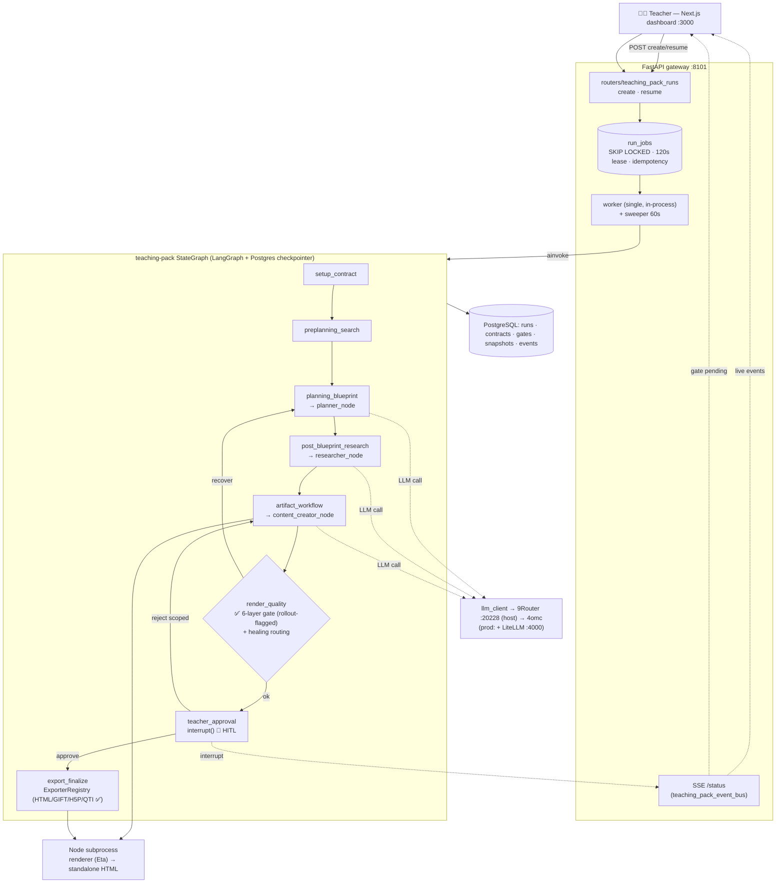
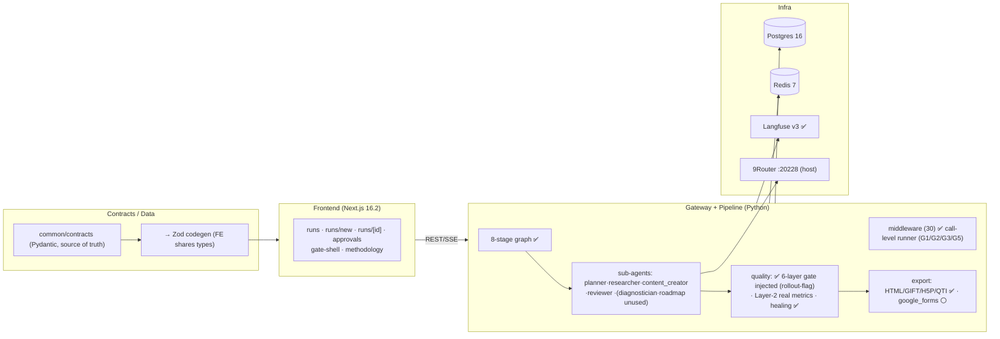

# oh-my-class — System Architecture (as-built)

> Written 2026-06-30 from a fresh, evidence-based codebase audit (6 parallel readers, file:line verified).
> This documents **what is actually wired and running**, distinguishing it from modules that exist but are **not invoked**. Status legend: ✅ wired & functional · 🟡 wired but thin/partial · ⚪ exists but **not wired** · 🔴 stub/broken.

---

## 1. What it is

AI teaching-pack generator for K-12 (Vietnam-first). A teacher describes a lesson; the system runs a multi-stage LangGraph pipeline (with teacher approval gates) and produces standalone, print-ready HTML artifacts (lesson, worksheet, quiz, drill, recap, infographic, …).

### Stack (verified)
| Layer | Tech | Notes |
|---|---|---|
| Orchestration | LangGraph 1.x | single 8-stage graph + `interrupt()` gates + Postgres checkpointer |
| Backend | FastAPI (Python 3.12) | gateway on **:8101** (dev; per Makefile + FE default) |
| Frontend | **Next.js 16.2 / React 19.2** | App Router, TanStack Query + Zustand, Tailwind 4 |
| Renderer | Eta (TS) via **Node subprocess** | standalone HTML; DOMPurify/sanitize-html |
| LLM | OpenAI-compatible → **9Router** | all agents use alias **`4omc`** |
| LLM proxy (prod) | LiteLLM :4000 | optional; dev calls 9Router directly |
| Cache | Redis 7 | ephemeral (noeviction, no persistence) |
| DB | PostgreSQL 16 | runs, checkpoints, contracts, jobs, snapshots, events |
| Observability | Langfuse v3 | integrated, degrades gracefully if unconfigured |
| Validation | Pydantic v2 → Zod (codegen) | Python is source of truth |

> **Port note:** code default and `.env.example` both use the host 9Router endpoint `http://localhost:20228/v1`. Gateway is `:8101` in dev. (Older docs said `:8001` — incorrect.)

---

## 2. Runtime topology — ONE graph

There is a **single authoritative runtime**: the teaching-pack 8-stage graph. The older 18-node `build_oh_my_class_graph` has been **removed**, and the legacy `/run` create + `/run/approve` routes return **HTTP 410** (decommissioned).

```
Teacher (Next.js :3000) ──REST/SSE──▶ FastAPI gateway :8101
                                         │
   POST /teaching-packs/runs  ──▶ create Run + enqueue RunJob (Postgres)
                                         │
   background worker (claim, 120s lease, SKIP LOCKED) ──▶ graph.ainvoke()
                                         │
              teaching-pack StateGraph (LangGraph + Postgres checkpointer)
                                         │
   gate interrupt() ──▶ run pauses ──▶ teacher resumes ──▶ new RESUME job
```

`packages/agents/graph.py` (legacy) — **removed**. `packages/agents/state.py::OhMyClassState` — **legacy, unused** (the runtime uses an inline `TeachingPackState`).

### System diagram — runtime flow



### Component layers (status)




---

## 3. The 8-stage pipeline

`packages/agents/teaching_pack/graph.py` + `stages.py` + `nodes.py`:

```
setup_contract → preplanning_search → planning_blueprint → post_blueprint_research
  → artifact_workflow → render_quality → teacher_approval → export_finalize → END
```

| Stage | Does | Sub-agent |
|---|---|---|
| setup_contract | extract contract/artifact_types | — |
| preplanning_search | build research brief (thin) | — |
| planning_blueprint | lesson plan | ✅ `planner_node` |
| post_blueprint_research | enrich research | ✅ `researcher_node` |
| artifact_workflow | generate artifacts | ✅ `content_creator_node` |
| render_quality | quality check + healing routing | ✅ 6-layer gate (see §6) |
| teacher_approval | **HITL `interrupt()`** | — |
| export_finalize | write exports | ✅ HTML/GIFT/H5P/QTI (see §8) |

**Conditional routing:** after `render_quality` → recovery routes (`planning_blueprint` / `post_blueprint_research` / `artifact_workflow` / `teacher_approval`); after `teacher_approval` → `export_finalize` (approve) or `artifact_workflow` (scoped reject).

### Sub-agents (6) — `packages/agents/sub_agents/`
`planner`, `researcher`, `content_creator`, `reviewer`, `diagnostician`, `roadmap_agent`. All invoked as **direct node functions** (`await x_node(state)`) — there are no per-agent StateGraph wrappers in the runtime. `diagnostician`/`roadmap_agent` exist but are **not stages** in the 8-stage graph (no diagnostic/roadmap stage wired).

### Agent-interaction substrate (as-built constraints)
The agents are **imperative calls inside stage nodes**, not graph nodes themselves — so the planned interaction work is shaped by what the runtime does/doesn't use today:
- ⚪ `Command(goto=…)`, `Send(…)`, and `BaseStore`/`PostgresStore` (long-term store) are **not used anywhere** in the runtime. Routing is entirely `add_conditional_edges` returning node-name strings (`route_after_render_quality`, `route_after_teacher_approval`).
- 🟡 The live `TeachingPackState` has **no `Annotated[…, reducer]` channels**; artifact merging is **imperative** (`_merge_regenerated_artifacts` in `nodes.py`, arrival-order). The only reducers (`merge_artifacts`, `merge_exported_files`) live on the **unused legacy** `OhMyClassState`.
- ⚪ **No cross-run memory** (research-cache, ClassKG, KT-mastery, etc.) exists yet — only function-level `@lru_cache` over embedded JSON in `grounding/retrieval.py`.
- Inter-agent handoff carries the **full** `lesson_plan`/`research_bundle` in state; `summarizers.py` truncation is **prompt-side inside `content_creator`**, not a lossy graph handoff.
> These constraints (and the planned subsystem that builds on them) are tracked in `.scratch/agent-interaction/` (stage = agent graph-identity; typed seam contracts; BaseStore substrate; state-flag/conditional-edge revision protocol; `Send` sub-agent fan-out). **Planned, not built.**

### Lead agent
The `create_react_agent` runtime (`agent.py`/`node.py`) and `lead_agent_node` bridge have been **removed** (confirmed by `architecture.manifest.json::lead_agent_present=false`). Parked helpers (`config.py`, `recovery.py`, `tools.py`) remain in `packages/agents/lead_agent/` — middleware and sub-agent call sites that still use them retain those references; the ReAct orchestrator itself is gone.

---

## 4. Gates (HITL)

Gate registry **exists**: `services/gateway/teaching_pack_gate_registry.py`:
- Gates: `clarification_required`, `contract_confirmation`, `search_plan_confirmation`, `blueprint_approval`, `content_approval`.
- Actions: `answer`, `approve`, `reject`, `edit` (validated per-gate by `validate_gate_response`).

Mechanics: `teacher_approval` stage calls LangGraph `interrupt()`; a `GateInterrupt` row is opened (partial-unique index: one ACTIVE gate per (run, gate_name)); teacher resumes via `POST /teaching-packs/runs/{id}/resume`; a `GateResponse` is recorded; a RESUME `RunJob` is enqueued. Contract edits at `contract_confirmation` bump a `ContractRevision`.

---

## 5. Persistence & control plane

**DB (PostgreSQL, 13 Alembic migrations).** Key models:
- `Run` (run_id, teacher_id, status, lesson_plan, theme, retention_days, soft-delete cols), `Artifact`, `CostLog`.
- `RunStatus` enum (10): pending, planning, researching, generating, reviewing, awaiting_approval, exporting, completed, failed, cancelled. *(No `blocked`/`partially_complete` — unit states would be computed, not persisted.)*
- Control: `RunStatusHistory`, `RunContract` + `ContractRevision`, `GateInterrupt`, `GateResponse`, `RunEvent` (sequenced, visibility TEACHER/ADMIN/INTERNAL).
- Jobs: `RunJob` (kind START/RESUME, status, **idempotency_key UQ**, attempts, **eligible_at**, lease_owner/expires).
- Artifacts: `ArtifactWorkflow` (per-artifact state), `ArtifactSnapshot` (content_hash UQ, teacher + student HTML, renderer/template/theme versions).
- Ops: `Notification` + `NotificationDeliveryRecord`, `BudgetLedgerRecord` (per-run tokens/searches/fetches/retries), `ReleaseEvidence`, `ProviderEvidence`.

**Job execution.** `teaching_pack_job_store.py` (claim with `FOR UPDATE SKIP LOCKED`, 120s lease, idempotency, `eligible_at` for queued/backpressure) → worker (`teaching_pack_worker.run_one`) + **sweeper** every 60s (`sweep_stuck_jobs` resets expired leases / fails after 3 attempts; `sweep_escalated_gates`). Resume is a separate job, so gates do **not** pin the worker. Multi-worker concurrency available via `WORKER_CONCURRENCY` env var (default 1 for solo-operator).
> ✅ **Lease heartbeat active** (`_execute_with_heartbeat()` + `_heartbeat()` loop + `renew_lease()`; interval = `lease_seconds / 3` = 40s). A stage running longer than 40s renews its lease before expiry — no latent double-execution risk.

**SSE.** `teaching_pack_event_bus.py` = in-memory per-run version counter + waiters, notified after DB commit. `GET /teaching-packs/runs/{id}/status` replays `RunEvent` (visibility=TEACHER) from DB then waits. (`packages/agents/events.py` is a second in-memory bus; not the durable source of truth.)

**Retention/privacy (real):** `retention.py` (per-category windows + per-run override), `soft_delete.py`, `purge.py` (`purge_expired_runs` hard-delete + `purge_student_evidence` PII redaction). PII scrubber `packages/quality/layer2_content/pii.py` is production-grade (VN + EN names, contacts, IDs) with audit log.

---

## 6. Quality — 6-layer gate now injected

**What runs in `render_quality`** (✅ `quality_runtime.py` → `GatewayTeachingPackQualityGate` → full 6-layer system):
1. **Fast pre-check** (`quality_issues()`): schema validation, placeholder regex, answer-key-leakage, `accessibility.language`, pack coherence (quiz↔lesson alignment, Bloom coverage, VN difficulty distribution 40/30/20/10).
2. **Layer-2 content** (real metrics, not stubs): `pedagogical.py` (objective-alignment, Bloom, CLT load, misconception-coverage via real proxies; unmeasured metrics excluded from pass), `age_check.py` (Flesch-Kincaid + age-band table), `fact_check.py` (claim verification against `research_bundle` sources; no sources → `unmeasured`), `readability_checker.py`, `pii.py`, `methodology.py`.
3. **Layer-3 HTML** (`html_validator.py`): DOCTYPE, no external assets, no brand strings, no native radio, no unmanaged JS — auto-fail hard-blocks.
4. **Layer-4 G-Eval** (`layer4_judge/`): majority-vote 3-judge scoring; `hard_blocks.py` auto-fail.
5. **Layer-6 export** readiness check.

Gate is **rollout-flagged** (`OMC_ENABLE_SIX_LAYER_QUALITY`, default `true`): injected as `GatewayTeachingPackQualityGate()` in `lifespan`. Pass threshold: `overall ≥ 7.0` AND no critical/hard-block. On failure → healing routing (§7). LLM-judge layers use 9Router `4omc`.

**Gateway artifact-workflow quality** (✅ separate, also wired): `services/gateway/artifact_workflow.py` runs `validate_artifact_content()` (placeholder / answer-key / PII / accessibility) during artifact generation, with `try_heal_artifact()`.

> Net: the live path runs all 6 layers for each artifact: fast schema/coherence pre-check → real Layer-2 pedagogical/age/fact metrics → HTML hard-blocks → G-Eval 3-judge → export readiness. Manifest boolean `quality_gate_injected` is machine-verified each CI run.

---

## 7. Healing (✅ wired)

`packages/agents/teaching_pack/healing_runtime.py` → `HealingOrchestrator` (`packages/agents/healing/orchestrator.py`) with strategies **retry → rewrite → reroute → replan → escalate** selected by fail-count/type. Invoked from `render_quality` on quality failure; sets `quality_recovery_route` consumed by `quality_routing.py` (routes back to planning/research/artifact_workflow or escalates to teacher_approval).

---

## 8. Rendering & export

**Render boundary (✅):** `services/gateway/renderer_adapter.py` spawns a **Node subprocess** (`node packages/renderer/dist/agent-renderer.js`) per artifact — JSON via stdin → HTML via stdout, **30s timeout**, fail-closed on error/empty/invalid, post-render standalone validation (DOCTYPE, no external URLs). Called from `artifact_snapshot_service.py`, `teaching_pack_completion.py`, `teaching_pack_export_writer.py`.

**Renderer (✅):** `packages/renderer/` — Eta singleton (`autoEscape:true`), **57 templates** (1 base + 11 pages + 45 components), 3 themes (default/forest/ocean via `common/branding/kits/`), per-artifact-type DOMPurify/sanitize-html configs, SVG sanitizer, external-URL guard (INVARIANT-04). Question registry + 8 question types; 4 scoring strategies incl. **`vietnamese-tf-2025`** (QĐ764 0.1/0.25/0.5/1.0).

**Export (`export_finalize` → `ExporterRegistry`, `packages/agents/teaching_pack/exporters.py`):**
- ✅ **HTML** — functional (real files).
- ✅ **gift / h5p / qti** — registry resolves each; `packages/exporters/src/{gift,h5p,qti}` exporters are functional. Fail-closed: a requested format with no registered exporter raises (never silently falls back to HTML).
- ⚪ **google_forms** — exporter is fully built (OAuth `auth.ts`, `client.ts` createForm/batchUpdate, `question-mapper.ts`) but the registry raises `UnsupportedExportFormatError` (in `_UNSUPPORTED_FORMATS`).
- ✅ **anki-apkg / flashcard-tsv** — implemented in `packages/exporters/src/` (functional, not invoked by the teaching-pack flow).

---

## 9. LLM routing

- **Model config** `packages/agents/config/models.py`: every agent/task uses alias **`4omc`** (no per-tier differentiation, no version pinning); per-agent `max_tokens` caps.
- **Client path (single)**: `packages/llm_client/` (OpenAI SDK + cost tags + `TokenBudgetManager` soft/hard limits + call-level middleware runner). All sub-agents route through it. `packages/agents/llm/transport.py` is orphaned (no live importers; guarded by `tests/test_no_legacy_transport.py`). Endpoint = `LLM_BASE_URL` (host 9Router default `:20228`; optional production LiteLLM uses `http://litellm:4000`).
- **Cost tags** (INVARIANT-07): `build_tags()` attaches `agent/task/run/step` metadata as `extra_body` (LiteLLM logs it; 9Router ignores).
- ✅ **9Router runs on the host (by design)**: the dev/operator runs 9Router locally on `:20228` and agents call it directly via `LLM_BASE_URL`. `services/router/Dockerfile` is an intentional placeholder because 9Router is **not containerized** — it lives on the host. For the current single-operator (dev = teacher) setup this is the correct topology, not a defect. (If/when multi-tenant hosting is needed, 9Router would be containerized or replaced.)
- ✅ **LiteLLM** proxy is a real image (`ghcr.io/berriai/litellm`), prod-only, routes → 9Router, `max_budget=0` (no paid fallback).
- ✅ **Langfuse** tracing integrated (`observability/tracing.py` `trace_node`/`trace_llm_call`), degrades to no-op when unconfigured.

---

## 10. Frontend (`apps/web/`)

Next.js 16.2 / React 19.2. Routes under `(dashboard)/`: `runs` (list), `runs/new` (create + methodology picker), `runs/[runId]` (detail + live SSE gates), `approvals`. `middleware.ts` gates the dashboard on the `auth-token` cookie. State = TanStack Query (server) + Zustand (UI).

- API client `lib/api-client.ts` → gateway (default `:8101`), Bearer from cookie, X-Request-ID.
- `hooks/use-teaching-packs.ts`: create/resume mutations + **SSE consumer** (`/teaching-packs/runs/{id}/status`, named events, backoff, lastEventId). Legacy `use-run.ts`/`use-approval.ts` still present (some stubbed: `usePendingApprovals` returns []).
- Gate UI: `teaching-packs-gate-shell.tsx` + `teaching-packs-gate-bodies.tsx` (clarification / contract / search-plan / blueprint / content-approval bodies; content-approval shows snapshot preview iframes student/teacher).
- **Methodology system** (`components/methodology/`): 9 tags from the codegen'd `methodology_registry`, compatibility/conflict rules, inverse-thinking editor.
- 🔴 Stubs: login page / JWT verify in `middleware.ts` (presence-only), `usePendingApprovals`.

> No `/units` route, no effectiveness/outcome UI — those features are **planned, not built** (see §13).

---

## 11. Contracts & schema codegen

Pydantic in `common/contracts/` is the **source of truth**: `run_contract`, `lesson_plan` (+ `MethodologyMetadata`), `artifact`, `quality`, `judge_output`, `inverse_thinking`, `methodology_registry` (9 tags), `diagnostic_report`, `research_*`, `roadmap`, `rubric`, `student_profile`, component models.

Codegen (`scripts/generate_zod_schemas.py`): Pydantic → JSON Schema → Zod TS in `common/schemas/src/generated/` for `lesson_plan`, `artifact`, `judge_output`, `inverse_thinking`, `methodology_registry`. Parity enforced by `scripts/verify_schema_parity.py`; FE API types verified by `scripts/verify_frontend_api_contracts.py`. FE transport types (`teaching-pack-api.ts`) are hand-written + verified.
> 🟡 **No `schema_version`** on any contract yet (despite ADR-012 calling for it).

---

## 12. Infrastructure

`infra/compose/docker-compose.yml`: `db` (PG16), `redis` (auth, noeviction), `gateway`, `proxy` (LiteLLM), `web`, `langfuse-web` + `clickhouse` + `minio` (+ `langfuse-worker` profile).
- ✅ `docker-compose.prod.yml` has no dangling `9router` depends_on (removed). **9Router runs on the host, not in compose** — intentional for the current single-operator setup. If/when multi-tenant hosting is needed, 9Router would be containerized or replaced.
- Dev defaults in `.env` (`POSTGRES_PASSWORD=omc_dev`, `REDIS_AUTH=…`, `LANGFUSE_ENCRYPTION_KEY=000…`) must be overridden for prod; **no startup guard** enforces this.
- Packaging: `uv` workspace (Python) + `import-linter` boundaries; `pnpm`/Turborepo + Biome (TS).

---

## 13. Hard invariants (enforced)

INVARIANT-04 no external URLs in HTML (post-render guard) · INVARIANT-05 answer keys teacher-only (regex + sanitizer) · INVARIANT-06 teacher gate via `interrupt()` (24h TTL → escalate) · INVARIANT-07 LLM calls carry metadata tags · INVARIANT-08 clarification middleware last · INVARIANT-10 contracts canonical in `common/contracts`.

---

## 14. Reality check — wired vs. not, and what's planned

**Wired & functional (✅):** single 8-stage graph · sub-agents (planner/researcher/content_creator) · gate registry + HITL interrupt/resume · job queue/worker/sweeper · checkpointer · SSE · healing (5-strategy) · HTML/GIFT/H5P/QTI render + export · **6-layer quality gate** (rollout-flagged, default on; real Layer-2 metrics, G-Eval 3-judge) · gateway artifact-workflow quality (placeholder/answer-key/PII/accessibility) · **call-level middleware runner** (G1/G2/G3/G5) · retention/purge/PII · Langfuse · methodology system + Zod codegen · frontend create/monitor/approve.

**Wired but thin/partial (🟡):** worker pool configurable via `WORKER_CONCURRENCY` (default 1) · no schema_version on contracts.

**Exists but NOT wired (⚪):** google_forms exporter · diagnostician/roadmap as pipeline stages · legacy `OhMyClassState` (kept for healing adapter only).

**Stub / broken (🔴):** auth login + FE JWT verify · `.env` secret defaults.

**By design for solo-operator (not defects):** 9Router on host (not containerized) · single in-process worker · LiteLLM optional/prod-only.

**Planned, not built (in `.scratch/`, not in code):** topic-decomposition / multi-session units (ADR-017), learning-outcome effectiveness loop / knowledge-tracing (ADR-019), Wave 2+ features (unit_planner, persona, golden-dataset, Forms-capture, cost-cap, etc.), and the **agent-interaction subsystem** (`.scratch/agent-interaction/`: BaseStore semantic index, bounded revision protocol with state-flag/conditional-edge, interaction observability, `Send` parallel fan-out — native LangGraph, deterministic). Runtime-parity work (ADR-018: 6-layer gate, middleware runner, export formats, event-bus, sub-agent collapse) is **done** as of 2026-07-01. See `.scratch/ROADMAP.md`.

> **Status (2026-07-01):** All `runtime-parity` and `technical-debt` epics are confirmed done. Quality gate injected, middleware runner active, export formats wired (HTML/GIFT/H5P/QTI), legacy decommissioned — see `architecture.manifest.json` for machine-verified booleans. Open priorities tracked in `.scratch/priority-upgrades/`.

---

---

## 15. Keeping this document in sync with the code

Docs drift because they are hand-written and unverified (that's why the previous architecture doc was wrong). The fix (tracked in `.scratch/technical-debt/006`):

1. **Generate the volatile facts** — `scripts/generate_architecture_manifest.py` emits `docs/system/architecture.manifest.json` from code: stage list, routers, `RunStatus` values, gate names, migration count, exporter-registry formats, model assignments, and **wiring booleans** (`quality_gate_injected`, `middleware_runner_active`, `lead_agent_present`, `legacy_graph_present`). This doc cites the manifest for volatile lists instead of hand-maintaining them.
2. **CI drift test** — `tests/test_architecture_sync.py` fails the build when the manifest diverges from code (e.g. someone injects/removes the quality gate, adds a stage, or changes export formats). Structural/wiring claims are machine-checked; prose stays human-authored.

---

*Method: 6 parallel read-only explorations across orchestration, gateway/persistence, quality, renderer/export, LLM/infra, frontend/contracts; contradictions resolved by direct re-reading. All claims are file:line-checkable in the current tree.*
